# Argo CD & GitOps Patterns: Enterprise Reference Guide

This guide details the core architectural patterns for deploying and managing applications at scale using GitOps principles and Argo CD. It covers control plane topologies, manifest orchestration, repository layouts, promotion strategies, and inventory management.

---

## 1. Control Plane Topology Patterns
How you architect the deployment of the Argo CD control plane across your fleet.

### Hub-and-Spoke (Centralized Control Plane)
One management cluster hosts a single Argo CD instance that connects to the Kubernetes API servers of multiple remote target clusters (spokes).

#### Architecture Detail
In this topology, Argo CD treats remote cluster configurations purely as data. It does not run agents on the target clusters. Instead, it reads Kubernetes Secret primitives in the Argo CD installation namespace. When a remote cluster is registered, Argo CD opens long-lived HTTP watches (via `client-go` Informers) against the target Kubernetes API servers to populate its **Live State Cache**.

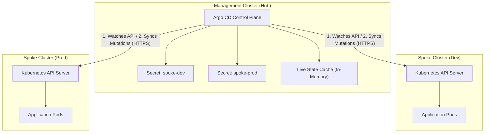

#### Under the Hood: Live State Cache
The `argocd-application-controller` does not poll every resource of every spoke cluster from scratch on a timer. Instead:
1. Upon startup/cluster discovery, it reads the cluster Secret.
2. It sets up an HTTP client connection pool to the spoke API.
3. It starts Informers that watch Kubernetes API resources (Services, Deployments, Pods, etc.).
4. The controller maintains a massive in-memory tree (the Live State Cache) representing the status of resources.
5. Reconciliation (drift detection) compares this cache with the parsed Git manifests, running purely in memory. The controller only sends network writes to target clusters when performing a Sync (mutation).

Because Argo CD is written in Go, it leverages Go’s concurrency model (goroutines, channels, and thread-safe data structures) alongside the Kubernetes `client-go` library to manage hundreds of remote clusters efficiently.

Below is an under-the-hood analysis of how a single `argocd-application-controller` pod manages connections, watches, and memory.

### 1. Connection Pool & HTTP/2 Multiplexing
When Argo CD discovers a cluster Secret, it instantiates a `client-go` config:

```go
// Conceptual cluster client initialization in Argo CD
config := &rest.Config{
    Host:            clusterSecret.URL,
    TLSClientConfig: rest.TLSClientConfig{ CAData: clusterSecret.CA },
    AuthProvider:    awsIAMTokenGenerator, // e.g., for EKS
}
clientset, err := kubernetes.NewForConfig(config)
```

- **Independent Transport Pools**: Argo CD instantiates a unique `http.Transport` per target cluster, keeping dedicated TCP connection pools.
- **HTTP/2 Multiplexing**: Since Kubernetes API servers support HTTP/2, Argo CD multiplexes streams for multiple resource watches across a single persistent TCP connection per cluster, minimizing socket exhaustion.

---

### 2. Informer Loop & Streaming HTTP Watches
Argo CD avoids polling target clusters. Instead, it utilizes the Kubernetes Reflector and Informer patterns to maintain up-to-date cluster states via background goroutines:

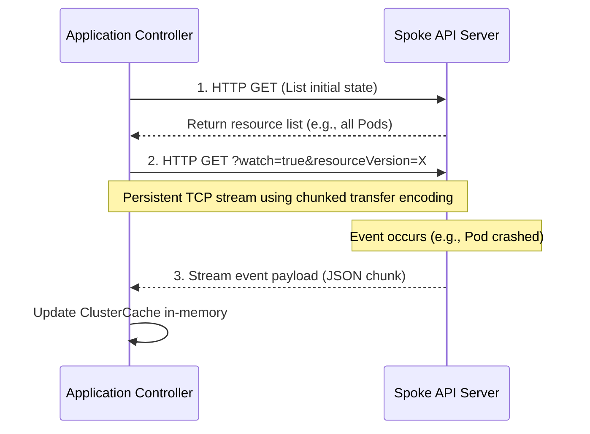

- **List Phase**: Upon startup, a goroutine issues a single HTTP request to fetch the resource state for the cluster.
- **Watch Phase**: The goroutine establishes a persistent, long-lived connection using the `?watch=true` query parameter. The spoke API server uses `Transfer-Encoding: chunked` to stream event updates as lightweight JSON payloads the instant changes occur.

---

### 3. The Thread-Safe Live State Cache
Once decoded, events update the local `ClusterCache` (implemented inside Argo CD's `gitops-engine` core):

```go
type ClusterCache struct {
    mu       sync.RWMutex
    Clusters map[string]*RemoteClusterInfo
}

type RemoteClusterInfo struct {
    Nodes map[kube.ResourceKey]*ResourceNode
}

type ResourceNode struct {
    ResourceVersion string
    ResourceKey     kube.ResourceKey
    State           *unstructured.Unstructured // Raw K8s manifest
    Children        []*ResourceNode            // Tree hierarchy: Deployment -> ReplicaSet -> Pod
}
```

- **Concurrency Control**: Updates lock specific cluster pointers via read-write mutexes (`sync.RWMutex`), rendering state updates highly concurrent and thread-safe.
- **Local Drift Calculation**: When comparing state to Git, Argo CD queries its RAM-resident `ClusterCache` rather than triggering network requests to the target clusters. Lookups take nanoseconds, ensuring high-throughput drift calculations.
- **UI Dependency Mapping**: When loading the Argo CD dashboard, the `argocd-server` queries this in-memory cache directly to render the hierarchical dependency tree.

---

> [!NOTE]
> **Lead-Level Interview Tip (Framing Scale & Syncs)**:
> *"Argo CD scales because its remote target reconciliation loop is completely non-blocking. It avoids polling spoke APIs. Instead, the application controller converts discovered cluster secrets into dedicated Go HTTP/2 transports. It spawns background client-go `ListWatch` goroutines that maintain persistent, chunked-transfer HTTP streams from target control planes. These streams feed a thread-safe, memory-resident graph cache. All drift detection calculations occur locally in memory, eliminating network latency issues during high-frequency syncs."*


### Reconciliation Mechanics: Drift & Sync for New Manifests
A core concern in declarative systems is how the controller handles a brand-new resource defined in Git that does not yet exist on the target cluster (and therefore has no active informer state).

---

#### 1. GVK-Scoped Watches
When `client-go` Informers establish watches, they subscribe to entire Kubernetes **GroupVersionKinds (GVKs)** at the namespace or cluster level, not individual resource instances.
- **Example request**: *"Watch all `apps/v1` `Deployments` in namespace `default`."*
- Even if the spoke cluster has zero deployments running, the HTTP/2 watch connection remains open. The moment any deployment is created, the API server sends a creation event down the stream, updating Argo CD's cache.

---

#### 2. Git-First Reconciliation
Drift detection is always driven by Git declarations, not cache states. When a new manifest (e.g., `frontend-v2`) is pushed to Git, the controller executes the following logic:

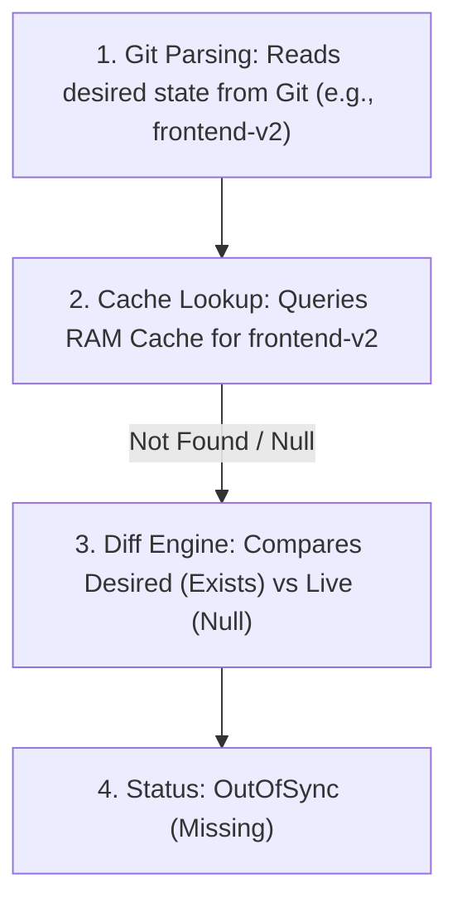

Because Git defines the desired state, the absolute absence of a corresponding object in the `ClusterCache` maps to `OutOfSync (Missing)`.

---

#### 3. Sync Loop Lifecycle
When a sync is triggered, the reconciliation loop is completed:

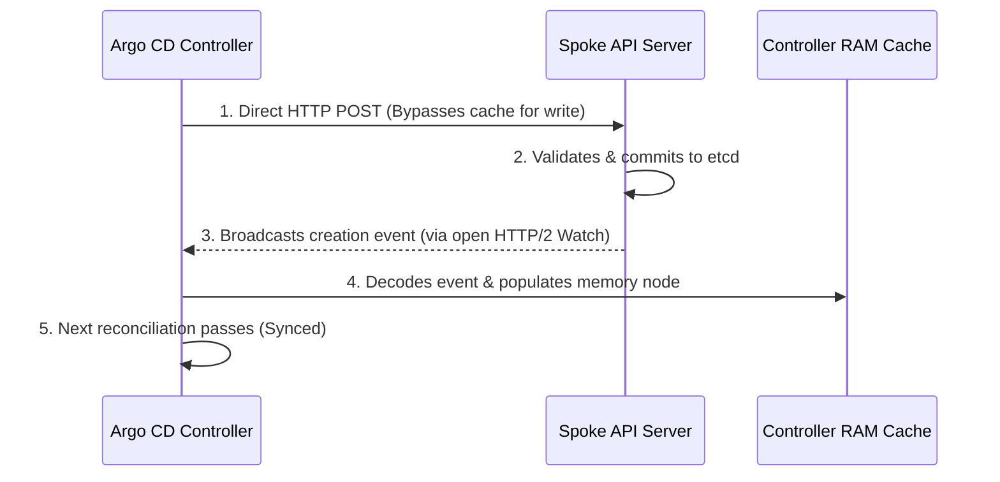

1. **Direct Write**: Argo CD sends an HTTP `POST` request directly to the spoke's API server, bypassing the read cache.
2. **Commit**: The spoke API server validates and writes the object to its local `etcd` store.
3. **Informer Catch**: The API server broadcasts the creation event back through the open watch stream.
4. **Cache Hydration**: The controller updates its in-memory map. The next drift check finds matches between Git and the cache, turning the application status to `Synced`.

---

> [!NOTE]
> **Lead-Level Key Takeaway**:
> Argo CD's memory cache is a bidirectional registry for the diff engine. Items declared in Git but absent from the cache trigger creation. Items absent in Git but present in the cache trigger pruning (if enabled). This enables high-performance drift management without polling endpoints.

#### Scaling with Controller Sharding
When managing hundreds of clusters, a single controller pod will hit CPU/memory limits or lock up its reconciliation queue. Argo CD supports scaling out via controller sharding:
- The `argocd-application-controller` is run as a Kubernetes `StatefulSet`.
- You scale it by setting `ARGOCD_CONTROLLER_REPLICAS` (e.g., to 4).
- The controller uses consistent hashing based on cluster UUIDs to distribute clusters dynamically across shards.
- Each controller replica only registers Informers and maintains the cache for its assigned subset of target clusters.

#### Spoke Cluster Registration Secret Example
```yaml
apiVersion: v1
kind: Secret
metadata:
  name: spoke-cluster-us-west-2
  namespace: argocd
  labels:
    argocd.argoproj.io/secret-type: cluster # Crucial: tells Argo CD this is a target cluster
    environment: production
    region: us-west-2
type: Opaque
stringData:
  name: prod-us-west-2
  server: https://api.prod-us-west-2.eks.amazonaws.com
  config: |
    {
      "awsAuthConfig": {
        "clusterName": "prod-us-west-2",
        "roleARN": "arn:aws:iam::123456789012:role/ArgoCDManagementRole"
      },
      "tlsClientConfig": {
        "insecure": false,
        "caData": "LS0tLS1CRUdJTiBDRVJUSUZJQ0FURS..."
      }
    }
```

> [!TIP]
> **The Lead's Take**: Best for centralized platform teams. It delivers a unified pane of glass, centralized Single Sign-On (SSO), and standardized RBAC across all environments.
> **The Trap**: Massive blast radius. An outage in the management cluster halts deployments globally. Performance limits require careful controller tuning and sharding adjustments at scale.

---

### Distributed (In-Cluster Deployment)
Every target Kubernetes cluster runs its own completely independent instance of Argo CD.

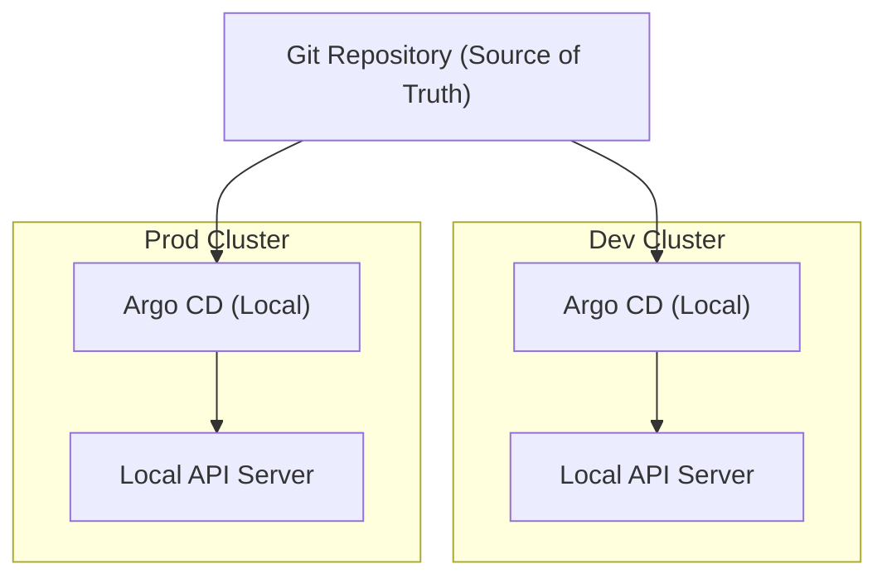

> [!TIP]
> **The Lead's Take**: Excellent for high security boundaries, isolated environments (e.g., edge, GovCloud), and strict blast-radius isolation. Cluster credentials never leave cluster boundaries.
> **The Trap**: High management overhead. Upgrades and policies must be maintained across multiple Argo CD installations. Fragmented visibility; developers must hop between different UIs to monitor applications.

---

### The Resilient Hybrid Pattern (Cell-Based Hubs)
To combine the benefits of centralized management with the isolation of distributed architectures, enterprises use cell-based hubs. Instead of one global hub, you deploy regional or environment-bounded hubs (e.g., US-East, US-West, EMEA hubs).

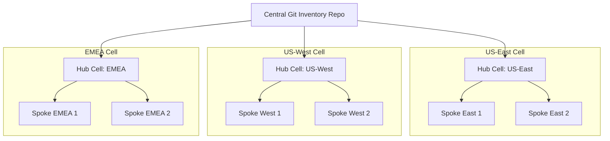

#### High Availability Components within a Cell
To achieve high availability inside each hub cell, scale individual components:
1. **Stateless API/UI Server (`argocd-server`)**: Scale horizontally (replicas >= 3) behind an Ingress controller or Load Balancer.
2. **Manifest Generator (`argocd-repo-server`)**: Scales horizontally. It computes manifest layouts (Helm/Kustomize). It is backed by a **Redis Sentinel** cluster (minimum 3 nodes) to cache calculated templates and minimize Git/processing operations.
3. **Application Controller (`argocd-application-controller`)**: Scaled horizontally using the StatefulSet sharding topology.

#### Disaster Recovery: Active-Passive DR
Because Argo CD is fully declarative, you do not need database replication (e.g., Velero or PV syncing) to backup the control plane. You maintain a standby cluster with Argo CD pre-installed but with automatic syncs disabled (or cluster secrets omitted).

If Region A experiences a catastrophic failure:
1. CI/CD or DNS routing applies the cluster configuration secrets and Application resources to the Standby Hub in Region B.
2. The Standby Hub establishes connection pools to target API servers.
3. It repopulates its live state cache and resumes sync operations.

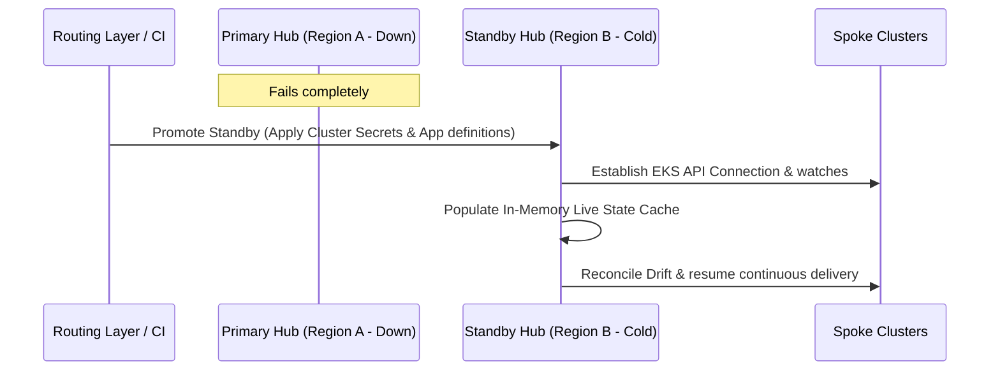

---

## 2. Manifest Orchestration Patterns
How you manage the deployment of hundreds of applications without manual configuration.

### App-of-Apps Pattern
A single root Argo CD `Application` points to a Git folder containing child `Application` custom resources (CRDs).

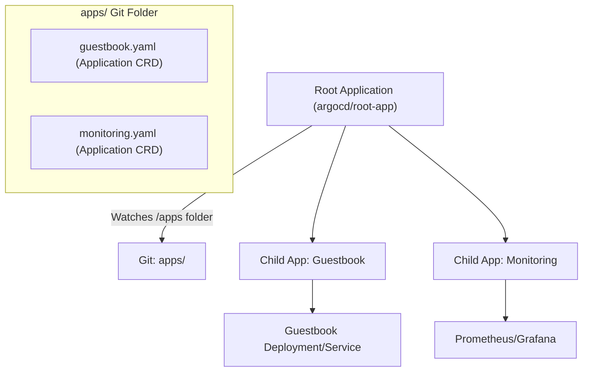

#### Directory Layout
```text
📂 cluster-bootstrap
├── 📁 bootstrap/
│   └── 📄 root-application.yaml   # Manually applied once to kick off the chain
└── 📁 apps/                       # Root application watches this directory
    ├── 📄 database.yaml           # Child Application CRD pointing to DB manifests
    ├── 📄 backend.yaml            # Child Application CRD pointing to Backend manifests
    └── 📄 frontend.yaml           # Child Application CRD pointing to Frontend manifests
```

#### Example Manifests

**Root Application Manifest:**
```yaml
apiVersion: argoproj.io/v1alpha1
kind: Application
metadata:
  name: root-app
  namespace: argocd
  finalizers:
    - resources-finalizer.argocd.argoproj.io # Deletes child apps if root is deleted
spec:
  project: default
  source:
    repoURL: https://github.com/enterprise/gitops-infra.git
    targetRevision: HEAD
    path: apps # Root app syncs the manifests inside the apps/ folder
  destination:
    server: https://kubernetes.default.svc
    namespace: argocd # Child Application CRDs must reside in the argocd namespace
  syncPolicy:
    automated:
      prune: true
      selfHeal: true
```

**Child Application Manifest (e.g., `apps/backend.yaml`):**
```yaml
apiVersion: argoproj.io/v1alpha1
kind: Application
metadata:
  name: backend-service
  namespace: argocd
spec:
  project: default
  source:
    repoURL: https://github.com/enterprise/backend-app-manifests.git
    targetRevision: main
    path: k8s/overlays/production
  destination:
    server: https://kubernetes.default.svc
    namespace: core-apps # Installs the actual backend resources in core-apps namespace
  syncPolicy:
    automated:
      prune: true
      selfHeal: true
```

> [!TIP]
> **Pros**: Fully native Kubernetes manifests, straightforward visual representation in the Argo CD UI.
> **Cons**: Static. Onboarding a new cluster or app requires writing and pushing a new YAML manifest. Prone to cyclic dependencies during initial bootstrap.

---

### ApplicationSets Pattern
The `ApplicationSet` controller uses generators (Git, Cluster, List, Matrix) to dynamically generate Argo CD `Application` instances based on variable values.

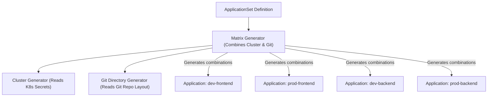

#### Example Manifest: Matrix Generator (Git + Cluster)
This ApplicationSet watches for any cluster secret with the label `environment` and combines it with a list of directories in Git to automatically generate applications.

```yaml
apiVersion: argoproj.io/v1alpha1
kind: ApplicationSet
metadata:
  name: enterprise-apps
  namespace: argocd
spec:
  generators:
    - matrix:
        generators:
          # Generator 1: Read target clusters
          - clusters:
              selector:
                matchLabels:
                  argocd.argoproj.io/secret-type: cluster
                  region: us-west-2
          # Generator 2: Read application directories in Git
          - git:
              repoURL: https://github.com/enterprise/monorepo-manifests.git
              revision: HEAD
              directories:
                - path: services/*
  template:
    metadata:
      name: '{{name}}-{{path.basename}}' # e.g., prod-us-west-2-payment-service
    spec:
      project: default
      source:
        repoURL: https://github.com/enterprise/monorepo-manifests.git
        targetRevision: HEAD
        path: '{{path}}/overlays/{{metadata.labels.environment}}' # Dynamic overlay resolution
      destination:
        server: '{{server}}' # Target cluster endpoint
        namespace: '{{path.basename}}'
      syncPolicy:
        automated:
          prune: true
          selfHeal: true
```

> [!TIP]
> **Pros**: Powerful automation. Automatically creates new application instances as soon as new cluster secrets are registered or new code directories are committed.
> **Cons**: High cognitive load to debug. A misconfigured ApplicationSet template can delete or modify resources across the entire fleet in seconds.

---

## 3. Repository Architecture Patterns
How code and configurations are grouped at the Git level.

### Split Repo Pattern (Enterprise Standard)
Enforces a strict separation of concerns by placing Application Source Code in one repository, and Kubernetes Configuration Manifests in a separate repository.

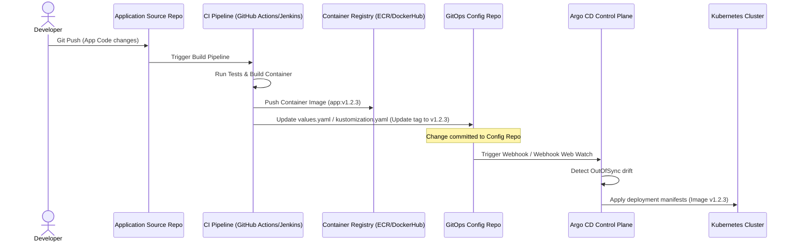

#### Why it Matters
- **Access Isolation**: Developers need write permission to App Code, but only SREs/Platform teams (or the CI bot) should have merge access to Production configurations.
- **Prevents Infinite Loops**: If source code and manifests reside in the same repository, a manifest tag update by the CI pipeline would trigger another CI pipeline build, causing a loop.
- **Auditing**: The Git log of the configuration repository serves as a clean, audit-friendly ledger of deployments.

---

### Monorepo vs. Polyrepo Configs

```text
Monorepo Layout:
📂 gitops-manifests-monorepo/
├── 📁 clusters/
│   ├── 📁 dev-us-east/
│   └── 📁 prod-us-west/
└── 📁 services/
    ├── 📁 authentication/
    └── 📁 checkout/
```

```text
Polyrepo Layout:
📂 config-auth-service/          # Repo 1: Auth Configs
├── 📁 overlays/
│   ├── 📁 dev/
│   └── 📁 prod/

📂 config-checkout-service/      # Repo 2: Checkout Configs
├── 📁 overlays/
│   ├── 📁 dev/
│   └── 📁 prod/
```

| Dimension | Monorepo Configuration | Polyrepo Configuration |
| :--- | :--- | :--- |
| **Visibility & Search** | **Excellent**: Global searches (`grep`) for values or ports are quick. | **Poor**: Hard to audit settings across dozens of repos. |
| **Argo CD Performance** | **Requires Tuning**: High git commits require webhook filtering and repo-server scaling to avoid bottlenecks. | **High Performance**: Small repos are fast to clone and process. |
| **Permissions (RBAC)** | **Complex**: Requires complex `CODEOWNERS` files for directory constraints. | **Simple**: Standard repository-level Git access permissions. |

---

## 4. Environment Promotion Patterns
How configuration changes safely progress through environments.

### Branch-per-Environment (Anti-Pattern)
Using branches (`dev`, `staging`, `production`) to represent target environments. Promotion consists of merging PRs from `dev` into `staging` and then into `production`.

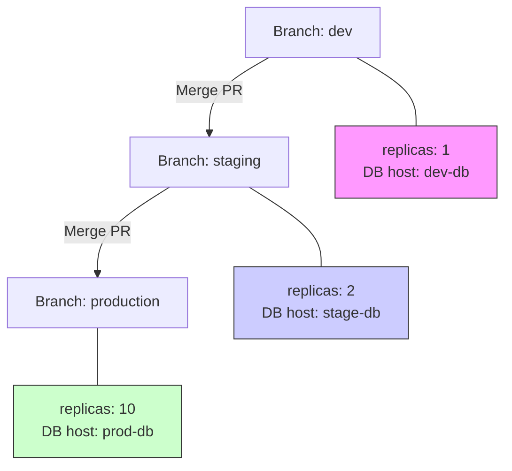

> [!WARNING]
> **The Interview Red Flag**: Do not recommend this. Real-world environments are rarely identical. Environment differences force branch-specific manual commits or cherry-picks. This leads to **Environment Drift**, unmerged changes, and complex merge conflicts when promoting code.

---

### Directory-per-Environment (Kustomize/Helm Overlays)
Using a single main branch and representing target environments using directory structures, resolving differences via Kustomize Overlays or Helm values overrides.

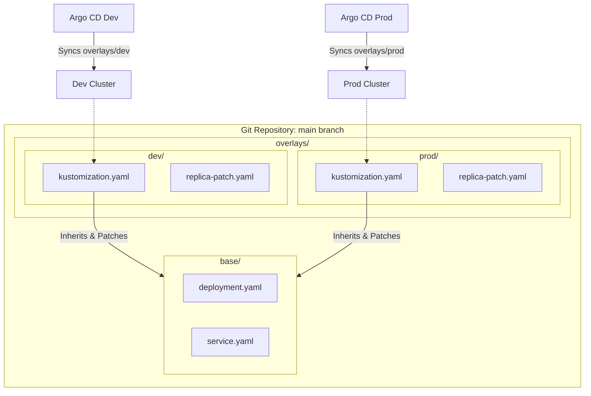

#### Example: Kustomize Base and Overlay

**Base Deployment (`base/deployment.yaml`):**
```yaml
apiVersion: apps/v1
kind: Deployment
metadata:
  name: payment-app
spec:
  replicas: 1
  template:
    spec:
      containers:
        - name: app
          image: enterprise/payment:latest
```

**Base Kustomization (`base/kustomization.yaml`):**
```yaml
resources:
  - deployment.yaml
```

**Dev Overlay Kustomization (`overlays/dev/kustomization.yaml`):**
```yaml
resources:
  - ../../base
patches:
  - target:
      kind: Deployment
      name: payment-app
    patch: |-
      - op: replace
        path: /spec/replicas
        value: 2
images:
  - name: enterprise/payment
    newTag: v1.2.0-dev
```

**Production Overlay Kustomization (`overlays/prod/kustomization.yaml`):**
```yaml
resources:
  - ../../base
patches:
  - target:
      kind: Deployment
      name: payment-app
    patch: |-
      - op: replace
        path: /spec/replicas
        value: 10
images:
  - name: enterprise/payment
    newTag: v1.1.8-prod
```

#### Promotion Flow via Image Tags
1. **Build**: App source build produces container image `v1.3.0`.
2. **Dev Promotion**: CI system commits a change updating the tag in `overlays/dev/kustomization.yaml` to `v1.3.0`. Argo CD syncs the Dev environment.
3. **QA/Staging Promotion**: Open a Pull Request changing the tag in `overlays/staging/kustomization.yaml` to `v1.3.0`. Merging this PR triggers Staging validation.
4. **Prod Promotion**: Open a Pull Request changing the tag in `overlays/prod/kustomization.yaml` to `v1.3.0`. Merging this PR triggers Production sync.

---

## 5. Decoupling Inventory Registry
Argo CD expects secrets inside its own namespace to establish remote cluster connections. Coupling cluster secrets directly to CI pipelines creates security and automation issues. Enterprises decouple the inventory registry by using external registries.

### Pull-Driven ESO (External Secrets Operator) Pattern
Metadata and credentials live in a secure, external secrets manager (AWS Secrets Manager, HashiCorp Vault). The External Secrets Operator running in the cluster dynamically creates the secrets expected by Argo CD.

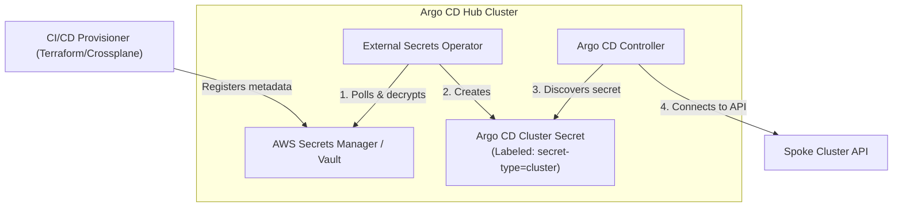

#### Example Configuration: ExternalSecrets Mapping
```yaml
apiVersion: external-secrets.io/v1beta1
kind: ExternalSecret
metadata:
  name: spoke-cluster-sync
  namespace: argocd
spec:
  refreshInterval: "5m"
  secretStoreRef:
    name: aws-secrets-manager
    kind: ClusterSecretStore
  target:
    name: dynamic-spoke-cluster-secret # Name of the generated secret
    template:
      metadata:
        labels:
          argocd.argoproj.io/secret-type: cluster # Ensures Argo CD discovers it
          environment: "production"
      type: Opaque
      data:
        name: "{{ .cluster_name }}"
        server: "{{ .api_endpoint }}"
        config: |
          {
            "awsAuthConfig": {
              "clusterName": "{{ .cluster_name }}",
              "roleARN": "{{ .iam_role_arn }}"
            },
            "tlsClientConfig": {
              "caData": "{{ .ca_data }}"
            }
          }
  dataFrom:
    - extract:
        key: prod/infrastructure/cluster-inventory
```

---

### Push-Driven IaC Registry Pattern (Terraform)
If your organization prefers a push-based model, use Terraform's official `argocd` provider to register clusters dynamically as part of the provisioning pipeline.

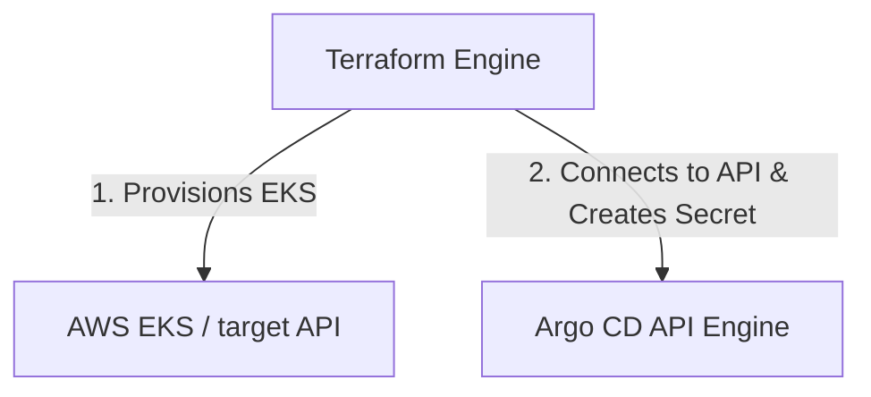

#### Example: Terraform Configuration
```hcl
provider "argocd" {
  server_addr = "argocd.internal.net:443"
  auth_token  = var.argocd_admin_token
  insecure    = false
}

resource "argocd_cluster" "spoke_cluster" {
  server = data.aws_eks_cluster.target.endpoint
  name   = "prod-us-east-1"

  config {
    aws_auth_config {
      cluster_name = "prod-us-east-1"
      role_arn     = "arn:aws:iam::123456789012:role/ArgoCDManagementRole"
    }
    tls_client_config {
      ca_data = base64decode(data.aws_eks_cluster.target.certificate_authority[0].data)
    }
  }
}
```

---

### Internal Developer Platform / CMDB Route
For huge setups, tools like Spotify's Backstage or NetBox serve as the source of truth. A lightweight sync controller (written in Go or Python) polls the CMDB api, compares the inventory with active Kubernetes Secrets in the `argocd` namespace, and uses `client-go` to create/delete secrets automatically.

#### Benefits of Decoupling Inventory
- **Cross-Tool Automation**: Other pipelines (e.g., Jenkins executing database migrations) can fetch EKS credentials from the same Secrets Manager path.
- **Least Privilege**: CI pipelines do not need administrative access to the Argo CD cluster to register spoke endpoints.
- **Resilient DR**: If the hub cluster is lost, re-running Terraform or syncing ESO immediately reconstructs the entire spoke inventory.