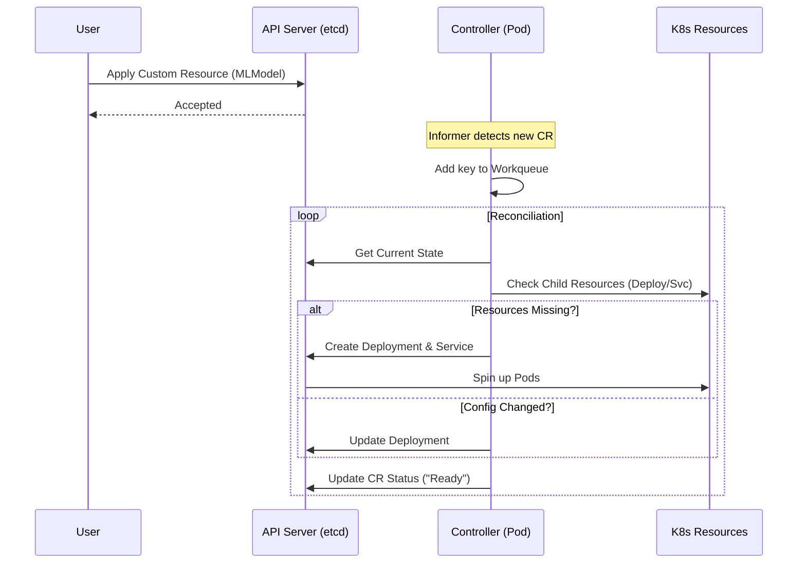

# Controller & Operator Pattern — "The Brains of the Operation"

This pattern represents the deep intelligence of Kubernetes. It explains how Kubernetes manages itself and how you can extend it to manage complex applications.

---

## 🧠 1. Concept: Controller vs. Operator

**Are they interchangeable?**
*Short Answer:* Colloquially, yes. Technically, no.

### The Nuance

*   **Controller**: This is the *mechanism*. It is a control loop that watches the state of the cluster and makes changes to move the **Current State** toward the **Desired State**. Kubernetes native objects (ReplicaSets, Deployments, Services) are all managed by controllers inside the `kube-controller-manager`.
*   **Operator**: This is a *pattern*. An Operator is a specific type of controller that encodes **human operational knowledge** (hence "Operator") to manage complex, stateful applications.

### The Formula
> **Operator** = Custom Resource Definition (CRD) + Custom Controller

### The Litmus Test
1.  **Controller**: If you write code that watches a standard Pod and deletes it if it uses too much memory.
2.  **Operator**: If you write a CRD called `PostgresCluster` and a controller that understands how to manage primary-replica failover, backups, and upgrades for that CRD.

---

## ⚙️ 2. Technical Details: The Reconciliation Loop

At the heart of this pattern is the **Reconcile Loop**. As a Lead, you need to understand the internals beyond just "it checks state."

### The Components

1.  **CRD (Custom Resource Definition)**: Extends the Kubernetes API. It allows you to store your custom configuration (Desired State) in etcd.
2.  **Informer / SharedInformer**: Instead of polling the API server (which is expensive), controllers use Informers to set up a long-lived **watch** connection. They maintain a local cache of the state to reduce load on the API server.
3.  **Workqueue**: When an Informer detects a change (Add/Update/Delete event), it queues the key (e.g., `namespace/name`) of the object into a Workqueue.
4.  **Reconciler**: This is the function you write. It pulls keys off the queue and executes the logic.

### Level-Triggered vs. Edge-Triggered

Kubernetes controllers are **Level-Triggered**. This is a vital concept for interviews and design.

| Type | Logic | Implication |
| :--- | :--- | :--- |
| **Edge-Triggered** | "I received an event that the file changed. I will process it." | If you miss the event (e.g., downtime), you are out of sync forever. |
| **Level-Triggered** (K8s) | "I see the current state is X and desired is Y. I will fix it." | **Self-Healing**. If your controller crashes and misses 50 events, it doesn't matter. When it wakes up, it looks at the current state of the world (the level) and reconciles it. |

---

## 🌍 3. Real-World Use Cases

Since you are interested in MLOps, this pattern is the backbone of that ecosystem.

| Use Case | Example | Why use an Operator? |
| :--- | :--- | :--- |
| **Stateful Databases** | Postgres / MongoDB Operator | Databases need specific sequences for upgrades (Snapshot → Spin down replica → Upgrade → Promote). A simple Deployment cannot handle this logic; an Operator can code this operational wisdom. |
| **ML Training Jobs** | TFJob / PyTorchJob (Kubeflow) | A TensorFlow training run might need 1 Parameter Server and 4 Workers. If a worker dies, the Operator knows if it should restart the whole job or just replace the worker. |
| **Certificate Mgmt** | Cert-Manager | It watches `Certificate` CRs. If a cert is expiring, the controller logic talks to Let's Encrypt, renews it, and updates the secret. |
| **Service Mesh** | Istio Operator | Manages the lifecycle of the complex Istio control plane components and sidecar injection. |

---

## 🔄 4. Technical Flow (The "Happy Path")

This flow demonstrates what happens when a user creates a Custom Resource (e.g., for an ML Model).



### Step-by-Step Breakdown

1.  **User Action**: User applies a YAML file for a Custom Resource (e.g., `kind: MLModelDeployment`).
2.  **API Server**: Validates the YAML against the CRD schema and stores it in etcd.
3.  **Controller Watch**: The custom controller (running in a pod) sees the new resource via its **Informer**.
4.  **Reconcile Logic**:
    *   **Check**: "Does the Deployment/Service for this Model exist?"
    *   **Result**: No.
    *   **Action**: Create a K8s Deployment and Service.
5.  **Loop**: The loop runs again.
    *   **Check**: "Do resources exist?" Yes.
    *   **Check**: "Is the configuration the same?" Yes.
    *   **Action**: Do nothing (**Idempotency**).


# Lab: The AppService Operator (Go & Kubebuilder)

## 1. Overview
This project implements the **Kubernetes Operator Pattern** for a custom resource called `AppService`.

*   **Goal**: To automate the lifecycle management of a web application.
*   **Mechanism**: Instead of manually creating Deployments, users define a high-level `AppService` intent. The Operator translates this intent into reality and ensures it stays that way (Reconciliation).

## 2. The Toolchain: Kubebuilder
We used **Kubebuilder**, which is the industry-standard SDK for building Kubernetes APIs.
*   **Purpose**: Kubernetes controllers require a massive amount of boilerplate code (registering with the API server, setting up caches/informers, handling leader election, metrics). Kubebuilder scaffolds 90% of this so we can focus solely on the business logic (the Reconcile loop).
*   **Under the Hood**: It relies on `controller-runtime`, a Go library that abstracts the complexity of `client-go`.

## 3. High-Level Project Structure
When we ran `kubebuilder init`, it generated a specific layout. Here is what matters:

| Directory/File | Purpose |
| :--- | :--- |
| `api/v1` | **The Contract**. Contains `_types.go`. This is where we defined the Go structs (`AppServiceSpec`) that map to the YAML users write. |
| `internal/controller` | **The Brain**. Contains the `Reconcile()` function. This is the code that runs every time something changes. |
| `cmd/main.go` | **The Entrypoint**. Initializes the "Manager," registers our controller, and starts the process. |
| `Makefile` | **Automation**. Contains scripts to generate manifests (`make manifests`), install CRDs (`make install`), and run the binary (`make run`). |
| `bin/controller-gen` | **The Generator**. A binary downloaded by the Makefile. It reads our Go structs (like `// +kubebuilder:validation:Minimum=1`) and auto-generates the massive YAML CRD files. |

## 4. Lab Walkthrough: The "Why" behind the "Do"

### Phase 1: The Schema (`api/v1`)
**Action**: We edited `appservice_types.go` to add `Replicas` and `Image`.
**Purpose**: Kubernetes is strongly typed. We cannot just accept "any JSON." We had to define a Go struct so the generator knows what data to expect.

```go
// appservice_types.go
type AppServiceSpec struct {
    // Replicas defines how many pods we want
    // +kubebuilder:validation:Minimum=2
    Replicas int32 `json:"replicas"`

    // Image defines which container image to run
    Image string `json:"image"`
}
```
*Lead Note*: We added markers like `Minimum=2`. This moves validation left—the API server rejects bad data before our code even sees it.

### Phase 2: Generating Manifests
**Action**: `make manifests`
**Purpose**: Go structs are for code; Kubernetes needs YAML. This command converts our Go structs into a **CustomResourceDefinition (CRD)** YAML file (`config/crd/bases/...`). This file tells Kubernetes: *"There is a new resource type called AppService."*

### Phase 3: Registration (`make install`)
**Action**: `make install`
**Purpose**: This pushes the CRD YAML to the API Server (Kind Cluster).
*Why this order matters*: You must do this **before** running the code. If you start the Operator binary before the CRD exists in the cluster, the Operator will crash immediately because it tries to set up a "Watch" on a resource type the cluster doesn't recognize yet.

### Phase 4: The Logic (The Reconcile Loop)
**Action**: We implemented `Reconcile` in `internal/controller`.
**Technical Detail**: This function is **Level-Triggered**.
1.  **Observe**: It fetches the `AppService` (User Intent) and the `Deployment` (Current Reality).
2.  **Analyze**: It compares them.
3.  **Act**:
    *   If Deployment is missing → `Create()`.
    *   If Deployment exists but Replicas don't match → `Update()` (**Drift Detection**).

```go
// internal/controller/appservice_controller.go

// Check 1: Are replicas correct?
if *foundDep.Spec.Replicas != *desiredDep.Spec.Replicas {
    foundDep.Spec.Replicas = desiredDep.Spec.Replicas
    shouldUpdate = true
}

// Check 2: Is image correct?
currentImage := foundDep.Spec.Template.Spec.Containers[0].Image
desiredImage := desiredDep.Spec.Template.Spec.Containers[0].Image
if currentImage != desiredImage {
    foundDep.Spec.Template.Spec.Containers[0].Image = desiredImage
    shouldUpdate = true
}

if shouldUpdate {
    l.Info("Drift detected. Updating Deployment.")
    err = r.Update(ctx, foundDep)
}
```

**Critical Component: OwnerReferences**
We used `ctrl.SetControllerReference`. This links the Deployment to the AppService.
*   **Benefit 1: Garbage Collection**. If you `kubectl delete appservice`, K8s automatically deletes the Deployment.
*   **Benefit 2: Events**. If someone deletes the Deployment manually, K8s triggers a Reconcile event for the parent AppService, causing immediate self-healing.

### Phase 5: The "Out-of-Cluster" Run
**Action**: `make run`
**Purpose**: Instead of building a Docker image, pushing it to a registry, and deploying a Pod (slow/heavy), we ran the binary on the host machine.
**How it works**: The binary looks for `~/.kube/config`. It uses your current user credentials to talk to the Kind API server over localhost. This provides a fast feedback loop (seconds) vs. a container build loop (minutes).

### Phase 6: Verification
**Action**: We changed `replicas: 2` to `replicas: 4`.
**Observation**:
1.  The API Server received the Update event for the AppService.
2.  It notified our local Operator binary via the **Watch** stream.
3.  Our Reconcile loop triggered.
4.  It saw Current=2 and Desired=4.
5.  It called `client.Update()`.
6.  The logs showed: `Drift detected. Updating Deployment.`

## 5. Summary of Technical Concepts Learned
*   **CRD vs. Controller**: The CRD is the data model (stored in etcd). The Controller is the active agent (ensuring the model is reality).
*   **Idempotency**: Our code is designed so that if we run the Reconcile loop 10 times in a row, the result is the same. We only update if there is a difference.
*   **Informer Cache**: By default, `r.Get` reads from a local memory cache (fast), while `r.Create/Update` writes to the API Server (authoritative).
*   **Self-Healing**: By treating the "Drift" scenario as a first-class citizen, the system automatically fixes configuration skew without human intervention.


## 6. Industry Context: The "Buy vs. Build" Decision

In the industry, the workflow usually looks like this:

1.  **Need**: "We need to manage SSL certificates" or "We need a Postgres cluster."
2.  **Find**: You grab the off-the-shelf Operator (e.g., Cert-Manager, Zalando Postgres).
3.  **Install**: Usually via Helm (`helm install cert-manager ...`).
4.  **Use**: You create the CRDs (YAML) that the Operator provides.