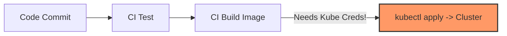
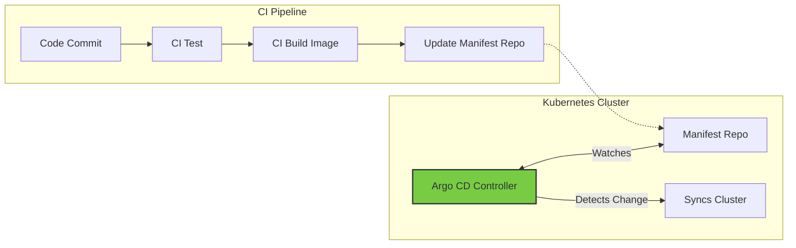

# Progressive Delivery with Argo CD & Argo Rollouts

This guide covers GitOps-based continuous delivery using **Argo CD** and progressive deployment strategies (Canary/Blue-Green) using **Argo Rollouts**. It is designed for Platform Leads and SRE Managers who need to understand these tools as governance and reliability engines.

---

## Table of Contents

1.  [Argo CD: The GitOps Enforcer](#1-argo-cd-the-gitops-enforcer)
2.  [Argo Rollouts: Progressive Delivery](#2-argo-rollouts-progressive-delivery)
3.  [Lab: Hands-On Canary Deployment](#3-lab-hands-on-canary-deployment)

---

## 1. Argo CD: The GitOps Enforcer

### 1.1. The Core Concept: GitOps

Argo CD is a GitOps continuous delivery tool for Kubernetes.

*   **Single Source of Truth**: Your Git repository contains the desired state of the system (YAMLs, Helm charts, Kustomize overlays).
*   **The Operator**: Argo CD is a Kubernetes controller that runs inside your cluster.
*   **The Reconciliation Loop**: It continuously monitors your running cluster and compares it against the Git repository. If they differ, it detects **"Drift."**

### 1.2. Push vs. Pull Model

In the traditional **"Push" model** (Jenkins, GitLab CI, GitHub Actions), the CI pipeline has credentials to talk to your cluster and runs `kubectl apply`. Argo CD flips this to a **"Pull" model**.

#### The Traditional "Push" Model



#### The Argo CD "Pull" Model (GitOps)



### 1.3. Why Platform Leads Choose Argo CD (The Business Case)

For an Engineering Manager or Lead, Argo CD solves three specific headaches:

| Concern | How Argo CD Helps |
| :--- | :--- |
| **Security** | Your CI pipeline builds the Docker image and updates the Git manifest. It does **not** need `kubeconfig` access. Argo CD pulls changes from *inside* the cluster. |
| **Drift Detection** | If a developer manually changes a deployment (`kubectl edit`), Argo CD flags the application as `OutOfSync`. You can configure **Self-Healing** to automatically revert manual changes. |
| **Disaster Recovery** | If your cluster dies, you point Argo CD at the new cluster and the Git repo. It reinstalls everything exactly as it was. |

### 1.4. Architecture & Terminology

*   **Application**: The core CRD. It maps a **Source** (Git repo path) to a **Destination** (Cluster + Namespace).
*   **Project**: A logical grouping of Applications. This is how you handle multi-tenancy (e.g., "Team A" can *only* deploy to "Namespace A").
*   **Sync**: The act of making the cluster match Git. Can be **Manual** or **Automatic**.

### 1.5. Advanced Use Cases

*   **Cluster Bootstrapping ("App of Apps")**: One Argo CD Application manages other Applications. This allows you to spin up a new cluster with Monitoring, Logging, and Ingress controllers *automatically* installed just by pointing Argo at a single repo.
*   **Progressive Delivery**: Argo CD deploys the resource. Argo Rollouts (a separate tool) watches the resource and handles traffic shifting (Canary/Blue-Green).

---

## 2. Argo Rollouts: Progressive Delivery

> [!NOTE]
> **Argo CD vs. Argo Rollouts**
> *   **Argo CD** is for **Delivery** (Getting the YAML from Git to K8s).
> *   **Argo Rollouts** is for **Traffic Management** (Shifting traffic from v1 to v2).
> *   They are often used together, but they are **distinct tools**.

### 2.1. Canary vs. Standard Rolling Update

In a standard Kubernetes Deployment using a **Rolling Update** strategy, the focus is on availability during an update. Kubernetes progressively replaces old pods with new ones.

**The Risk**: Readiness probes only check if the process is up. They do not validate business logic or performance metrics. If you ship a bug that only appears under load or specific user queries, a Rolling Update will propagate that bug to 100% of your users very quickly.

**The Canary Advantage**: A Canary Deployment shifts the focus to **validation**. It exposes the new version to a small, controlled subset of traffic (e.g., 5% or 10%).

**Why Argo Rollouts?** Native Kubernetes Deployments cannot do fine-grained traffic splitting (percentage-based) without complex mesh configurations or manual replica scaling. Argo Rollouts introduces a Custom Resource Definition (CRD) that manages the traffic shaping, analysis, and promotion automatically, allowing you to "pause" the rollout while you verify metrics.

### 2.2. Understanding the Argo Rollouts Installation

The Argo Rollouts system has two distinct components that live in different locations:

| Component | Location | Purpose |
| :--- | :--- | :--- |
| **Argo Rollouts Controller** | Inside the Kubernetes Cluster (e.g., Fedora VM / k3s) | A server-side component (a Deployment in the `argo-rollouts` namespace). It watches for `Rollout` CRDs, interacts with the Kubernetes API to create/scale ReplicaSets, and manages traffic routing. |
| **`kubectl argo rollouts` Plugin** | Your Local Machine (e.g., MacBook) | A client-side CLI plugin. This allows you to issue commands like `kubectl argo rollouts promote` or `kubectl argo rollouts get rollout`. It must be installed where you run `kubectl`. |

> [!TIP]
> **Summary**: Controller lives *inside* the cluster. CLI Plugin lives *outside* the cluster on your management machine.

---

## 3. Lab: Hands-On Canary Deployment

This lab guides you through a complete Canary deployment workflow using a "Vegetarian Menu API" as the example application. We will use a simple NGINX demo image to simulate version changes.

### 3.1. Prerequisites & Setup

#### A. Install the Argo Rollouts Controller

This controller manages the lifecycle of the `Rollout` resource.

```bash
# 1. Create the namespace
kubectl create namespace argo-rollouts

# 2. Install the Argo Rollouts controller
kubectl apply -n argo-rollouts -f https://github.com/argoproj/argo-rollouts/releases/latest/download/install.yaml

# 3. Verify the controller is running
kubectl get pods -n argo-rollouts
```

#### B. Install the `kubectl` Argo Rollouts Plugin

This is essential for visualizing the rollout steps and manually promoting the canary.

**For macOS:**

```bash
curl -LO https://github.com/argoproj/argo-rollouts/releases/latest/download/kubectl-argo-rollouts-darwin-amd64
chmod +x ./kubectl-argo-rollouts-darwin-amd64
sudo mv ./kubectl-argo-rollouts-darwin-amd64 /usr/local/bin/kubectl-argo-rollouts

# Verify installation
kubectl argo rollouts version
```

**For Linux:**

```bash
curl -LO https://github.com/argoproj/argo-rollouts/releases/latest/download/kubectl-argo-rollouts-linux-amd64
chmod +x ./kubectl-argo-rollouts-linux-amd64
sudo mv ./kubectl-argo-rollouts-linux-amd64 /usr/local/bin/kubectl-argo-rollouts

# Verify installation
kubectl argo rollouts version
```

---

### 3.2. Step 1: Base Deployment (The 'Blue' Environment)

First, we deploy the initial, stable version of our application.

**Manifest**: [01-initial-rollout.yaml](file:///Users/parthpatel/Documents/resources/personal/github/k8s-ref-patterns/patterns/deployments/manifests/01-initial-rollout.yaml)

This manifest creates:
1.  A `Rollout` resource (using `argoproj.io/v1alpha1` API) with 4 replicas running `nginxdemos/hello:plain-text`.
2.  A `Service` of `type: LoadBalancer` to expose the application.

**Apply the manifest:**

```bash
kubectl apply -f manifests/01-initial-rollout.yaml
```

**Verify the rollout:**

```bash
kubectl argo rollouts get rollout veggie-api-rollout --watch
```

> [!IMPORTANT]
> **Why `type: LoadBalancer`?**
>
> | Service Type | Connectivity | Drawback |
> | :--- | :--- | :--- |
> | `ClusterIP` | Internal-only. Requires `kubectl port-forward` to access. | Adds friction for labs and demos. |
> | `NodePort` | Exposes a high port (30000-32767) on every node. | "Ugly" URLs, firewall issues, not production-like. |
> | `LoadBalancer` | Provisions an external IP on standard ports (80/443). | **Best for labs.** k3s uses Klipper LB or MetalLB automatically. |
>
> **Result**: You can visit `http://<your-vm-ip>` directly on port 80.

---

### 3.3. Step 2: Add the Canary Strategy

Now we update the `Rollout` definition with a multi-step Canary strategy. The image stays the same; we are only changing the *rules of engagement* for future deployments.

**Manifest**: [02-canary-strategy.yaml](file:///Users/parthpatel/Documents/resources/personal/github/k8s-ref-patterns/patterns/deployments/manifests/02-canary-strategy.yaml)

**The Strategy:**

| Step | Action | Description |
| :--- | :--- | :--- |
| 1 | `setWeight: 20` | Route 20% of traffic to the new version (Canary). |
| 2 | `pause: {}` | Pause indefinitely until you manually run `kubectl argo rollouts promote`. |
| 3 | `setWeight: 50` | Route 50% of traffic to the new version. |
| 4 | `pause: {duration: 10s}` | Pause for 10 seconds, then auto-advance to 100%. |

> [!NOTE]
> **Traffic Splitting in k3s (Without a Service Mesh)**
>
> Since we are not using Istio or Linkerd, Argo Rollouts performs **"Replica Shifting."** It manipulates the number of pods to approximate the traffic percentage. With 4 replicas, asking for 20% usually results in 1 Canary pod and 3 Stable pods (effectively 25%, as that is the smallest unit available).

**Apply the manifest:**

```bash
kubectl apply -f manifests/02-canary-strategy.yaml
```

**Verify the definition:**

```bash
kubectl argo rollouts get rollout veggie-api-rollout --watch
```

> [!IMPORTANT]
> **Crucial Observation:** You should see **NO changes** in the pods (Status: `Healthy`, Replicas: `4`). Why? We only changed the *strategy* (the "how"), not the *pod template* (the "what"). Argo Rollouts detects no version change, so it doesn't trigger a rollout yet.

---

### 3.4. Step 3: Trigger and Monitor the Canary Rollout

#### A. Trigger the Rollout

Update the container image to a different tag. This tells the controller that the PodTemplate has changed, which triggers the Canary strategy.

```bash
kubectl argo rollouts set image veggie-api-rollout veggie-api=nginxdemos/hello:latest
```

#### B. Monitor the "Paused" State

Immediately run the watch command to see the traffic split in action:

```bash
kubectl argo rollouts get rollout veggie-api-rollout --watch
```

**What you should see:**

*   **Status**: `॥ Paused`
*   **Message**: `CanaryPauseStep`
*   **Replicas**: 1 Canary pod (new version), 3-4 Stable pods (old version).
*   **Weight**: `setWeight: 20` is active.

**Example Output:**

```text
Name:            veggie-api-rollout
Namespace:       default
Status:          ॥ Paused
Message:         CanaryPauseStep
Strategy:        Canary
  Step:          1/4
  SetWeight:     20
  ActualWeight:  20
Images:          nginxdemos/hello:latest (canary)
                 nginxdemos/hello:plain-text (stable)
Replicas:
  Desired:       4
  Current:       5
  Updated:       1
  Ready:         5
  Available:     5

NAME                                            KIND        STATUS     AGE    INFO
⟳ veggie-api-rollout                            Rollout     ॥ Paused   6m36s
├──# revision:2
│  └──⧉ veggie-api-rollout-68c7bb9554           ReplicaSet  ✔ Healthy  43s    canary
│     └──□ veggie-api-rollout-68c7bb9554-sxtw7  Pod         ✔ Running  43s    ready:1/1
└──# revision:1
   └──⧉ veggie-api-rollout-77bdc944b5           ReplicaSet  ✔ Healthy  6m36s  stable
      ├──□ veggie-api-rollout-77bdc944b5-7sb7z  Pod         ✔ Running  6m36s  ready:1/1
      ├──□ veggie-api-rollout-77bdc944b5-fzl6p  Pod         ✔ Running  6m36s  ready:1/1
      ├──□ veggie-api-rollout-77bdc944b5-l5wfv  Pod         ✔ Running  6m36s  ready:1/1
      └──□ veggie-api-rollout-77bdc944b5-m2m95  Pod         ✔ Running  6m36s  ready:1/1
```

---

### 3.5. Step 4: Promote the Rollout

We have verified (visually) that the new pods came up. In a real scenario, you would check your metrics (latency/errors). Since we are satisfied, let's manually approve the release.

**Open a new terminal** (keep the watch command running) and run:

```bash
kubectl argo rollouts promote veggie-api-rollout
```

**Back in your "Watch" terminal, observe:**

1.  Traffic weight increases to **50%** (2 Canary pods, 2 Stable pods).
2.  The controller automatically waits for **10 seconds** (the duration we set).
3.  After 10 seconds, it automatically scales the Canary to **100%** and terminates the old pods.

---

### 3.6. Final State

Once the process finishes, your output should look like this:

*   **Status**: `✔ Healthy`
*   **Strategy**: `Canary`
*   **Images**: `nginxdemos/hello:latest (stable)`
*   **Replicas**: `4/4`

---

## Summary: What You Built

You have successfully implemented a **Zero-Downtime Canary Deployment**.

```mermaid
flowchart LR
    subgraph Phase1 [Phase 1: Initial State]
        V1_1[V1 - Blue]
        V1_2[V1 - Blue]
        V1_3[V1 - Blue]
        V1_4[V1 - Blue]
    end

    subgraph Phase2 [Phase 2: Canary @ 20%]
        V2_1[V2 - Canary]
        V1_5[V1 - Stable]
        V1_6[V1 - Stable]
        V1_7[V1 - Stable]
    end

    subgraph Phase3 [Phase 3: Canary @ 50%]
        V2_2[V2 - Canary]
        V2_3[V2 - Canary]
        V1_8[V1 - Stable]
        V1_9[V1 - Stable]
    end

    subgraph Phase4 [Phase 4: Promoted @ 100%]
        V2_4[V2 - New Stable]
        V2_5[V2 - New Stable]
        V2_6[V2 - New Stable]
        V2_7[V2 - New Stable]
    end

    Phase1 -->|Image Update| Phase2
    Phase2 -->|Manual Promote| Phase3
    Phase3 -->|Auto after 10s| Phase4

    style V2_1 fill:#7c4,stroke:#333
    style V2_2 fill:#7c4,stroke:#333
    style V2_3 fill:#7c4,stroke:#333
    style V2_4 fill:#7c4,stroke:#333
    style V2_5 fill:#7c4,stroke:#333
    style V2_6 fill:#7c4,stroke:#333
    style V2_7 fill:#7c4,stroke:#333
```



1.  **V1 (Blue)** was running.
2.  **V2 (Canary)** was introduced to only ~20-25% of users.
3.  The rollout **paused automatically** to let you verify safety.
4.  You **promoted** it, and it gradually shifted to **100%**.