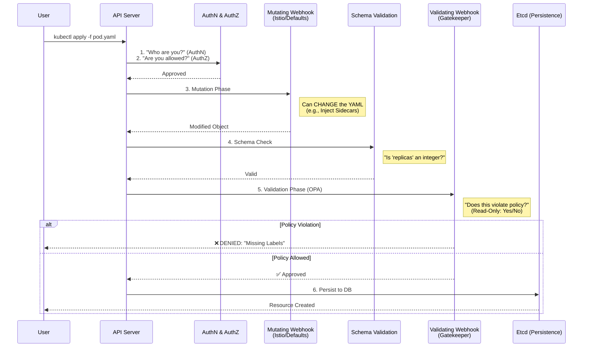

# OPA Gatekeeper Pattern — Policy as Code

[](https://kubernetes.io/)
[](https://www.openpolicyagent.org/)

## 📖 Executive Summary
To shift gears into **OPA (Open Policy Agent)** and **Gatekeeper**, it is helpful to stop viewing Kubernetes as just a platform for running containers and start viewing it as a **programmable API that requires governance**.

As an SRE Lead or EM, you will encounter OPA not just as a tool, but as a **"Policy-as-Code" framework** that ensures your 1,000+ microservices don't turn into a "Wild West."

### 🎯 The Goal: Automated Governance
*   **Old World**: SREs manually review generic Pull Requests to check if resource limits are set.
*   **New World (OPA)**: A "Bouncer" (Admission Controller) automatically rejects any manifest that violates the laws of the platform.

---

## 1️⃣ Concept: The Kubernetes Request Lifecycle

To understand how OPA Gatekeeper governs your cluster, you must understand the **API Request Lifecycle**. Think of the API Server as a high-security building with checkpoints.

### 🔍 Visualizing the "Hooks"



### The Two Types of Webhooks

| Feature | Mutating Webhook | Validating Webhook (OPA) |
| :--- | :--- | :--- |
| **Timing** | Runs **First**. | Runs **Last** (after mutation). |
| **Capability** | Can **Modify** content (e.g., inject sidecar). | **Read-Only**. Can only Approve or Deny. |
| **Execution** | Serial (One after another). | Parallel (Fast). |
| **Logic** | "If missing sidecar, add it." | "If missing sidecar, REJECT it." |

> **SRE Insight**: OPA runs *after* mutation implies that OPA validates the **final state** of the object. If Istio injects a sidecar that runs as `root`, and your OPA policy forbids `root`, OPA will catch it even if the user's original YAML didn't mention the sidecar.

---

## 2️⃣ OPA vs. Gatekeeper: What's the difference?

| Component | Description | Use Case |
| :--- | :--- | :--- |
| **OPA (The Engine)** | A general-purpose, open-source policy engine. It is decoupled from Kubernetes entirely. It takes JSON input + Rego Policy and outputs `true/false`. | Microservices AuthZ, Terraform CI/CD checks, SSH access control. |
| **Gatekeeper (The Implementation)** | The Kubernetes-native **Controller** that integrates OPA with the API Server. It creates CRDs (`ConstraintTemplate`, `Constraint`) to make OPA usable in K8s. | Enforcing K8s Best Practices, Security Standards. |

---

## 3️⃣ Enterprise Use Cases (The "Guardrails")

In a large enterprise, you use OPA Gatekeeper to enforce "best practices" that humans usually forget.

| Domain | Policy Example | Why it matters (The Risk) |
| :--- | :--- | :--- |
| **Security** | **Trusted Registries Only**<br>`"Images must come from gcr.io/my-corp/*"` | Prevents developers from pulling malware-infected images from Docker Hub. |
| **Stability** | **Require Resource Limits**<br>`"All containers must have CPU/Mem limits."` | Prevents "Noisy Neighbors" from starving critical workloads. |
| **Governance** | **Label Enforcement**<br>`"Must have 'cost-center' label."` | Crucial for FinOps/Billing transparency. |
| **Traffic** | **Ingress Host Uniqueness**<br>`"Host header must be unique."` | Prevents Team A from accidentally hijacking Team B's traffic. |
| **Security** | **Root Container Block**<br>`"Must runAsNonRoot: true"` | Reduces the blast radius if a container is compromised. |

---

## 4️⃣ The "Rego" Language

One of the hurdles for a Lead role is understanding **Rego**. It is a declarative query language. Unlike Python or Go, it doesn't execute line-by-line. It's more like SQL for your JSON data.

### Example: Enforcing an "Owner" Label

```rego
package kubernetes.admission

deny[msg] {
  # 1. Scope: Only check Pods
  input.request.kind.kind == "Pod"
  
  # 2. Logic: Check if 'owner' label is MISSING
  not input.request.object.metadata.labels.owner
  
  # 3. Message: Return this if the above is true
  msg := "Every pod must have an 'owner' label for billing purposes."
}
```

---

## 5️⃣ Project Structure Standard

When implementing Gatekeeper, organize your repository like this:

```text
patterns/opa-gatekeeper/
├── constraints/              # The "Instances" of policies
│   ├── production/
│   │   ├── require-labels.yaml
│   │   └── limit-ranges.yaml
│   └── staging/
│       └── require-labels-relaxed.yaml
├── templates/               # The "Logic" (Rego source code)
│   ├── k8srequiredlabels.yaml
│   └── k8sblocklatesttag.yaml
└── library/                 # External Rego libraries
```

*   **ConstraintTemplate**: The function definition. (e.g., "I know how to check for labels").
*   **Constraint**: The function call. (e.g., "Check that `deployment` objects have the label `cost-center`").

---

## 6️⃣ Lead Engineer Decisions

### A. Fail-Open vs. Fail-Closed

In your `ValidatingWebhookConfiguration`, you must set a generic `failurePolicy`.

*   **Fail (Closed)**: If OPA is down, **NO ONE** can deploy anything.
    *   *Pro*: Maximum Security. Nothing bypasses the check.
    *   *Con*: If OPA crashes, you take down the entire production deployment pipeline.
*   **Ignore (Open)**: If OPA is down, requests are **ALLOWED**.
    *   *Pro*: Stability. OPA outage doesn't block work.
    *   *Con*: Security Logic Gap. Bad pods might slip through during an outage.

> **Recommendation**: Start with **Ignore** during the pilot phase. Move to **Fail** only when you have high availability (3+ replicas) and monitoring on the OPA controller.

### B. "Dry Run" Mode

Before enforcing a policy that might break 50% of your deployments, use the `enforcementAction: dryrun` field in the Constraint.
*   It logs violations to the audit stream but **does not block** the request.
*   Use this to gather data on "Who is violating policy?" before turning on the block.


---

## 7️⃣ Hands-on Lab 1: Enforcing Label Standards

Let's walk through a real-world scenario: **Ensuring every production pod has an Owner.**

> [!NOTE]
> If you are targeting the remote `k3d` cluster set up over Tailscale (as described in [antigravity.md](file:///Users/parthpatel/Documents/resources/personal/github/k8s-ref-patterns/patterns/antigravity.md)), make sure your `KUBECONFIG` is exported in your current terminal session before running `helm` or `kubectl` commands:
> ```bash
> export KUBECONFIG=~/.kube/remote-k8s.yaml
> ```

### Step 1: Install OPA Gatekeeper (Helm)
As a Lead/SRE, you should manage system components via Helm.

```bash
# 1. Add the official OPA Gatekeeper Helm repository
helm repo add gatekeeper https://open-policy-agent.github.io/gatekeeper/charts
helm repo update

# 2. Install Gatekeeper into the gatekeeper-system namespace
helm install gatekeeper gatekeeper/gatekeeper \
  --namespace gatekeeper-system \
  --create-namespace
```

**Verification Checklist**:
1.  **Pods**: Ensure `gatekeeper-controller-manager` (The Webhook) and `gatekeeper-audit` (The Scanner) are running.
    ```bash
    kubectl get pods -n gatekeeper-system
    ```
2.  **CRDs**: Gatekeeper installs new resource types (`ConstraintTemplates`).
    ```bash
    kubectl get crd | grep gatekeeper
    ```

### Step 2: visual Architecture of the Policy
Gatekeeper uses a two-step **"Blueprint and Enforcer"** pattern.

1.  **ConstraintTemplate (The Class)**: Defines the Rego logic (the "how"). Reusable.
2.  **Constraint (The Instance)**: Defines the Scope (the "where"). Specific.

### Step 3: Deployment & Testing

**1. Apply the Blueprint (ConstraintTemplate)**
This teaches Kubernetes *how* to check for labels.
```bash
kubectl apply -f templates/lab-1/required-lables-constraint.yaml
```

**2. Apply the Rule (Constraint)**
This tells Kubernetes to *actually check* all Pods for the `owner` and `cost-center` labels.
```bash
kubectl apply -f templates/lab-1/label-enforcer.yaml
```

**3. The "Bad" Request (Expected Failure)**
Try to apply a Pod that has no labels.
```bash
kubectl apply -f templates/lab-1/bad-pod.yaml
```

**Expected Output**:
> `Error from server (Forbidden): error when creating "bad-pod.yaml": admission webhook "validation.gatekeeper.sh" denied the request: [ns-must-have-owner] You must provide these labels: {"cost-center", "owner"}`

✅ **Success!** The admission controller rejected the request.

---

## 8️⃣ Advanced Feature: The Audit Loop (Finding Existing Issues)

As an SRE Lead, your biggest fear isn't just *new* bad resources; it's the **5,000 resources that already exist** in the cluster.

Gatekeeper runs an **Audit Loop** in the background. It periodically scans every existing resource in the cluster against your Constraints.
*   **Result**: It does *not* break/delete existing apps (that would cause outages).
*   **Action**: It reports violations in the `.status` field of the Constraint.

**View Violations**:
```bash
kubectl get k8srequiredlabels ns-must-have-owner -o jsonpath='{.status.violations}'
```

This allows you to generate a "Compliance Report" and nag teams to fix their YAMLs before you flip the switch to `enforcementAction: deny`.


---

## 9️⃣ Enterprise Use Cases Deep Dive (Business Value)

This section categorizes policies by the **business value** they provide. This is how you explain Gatekeeper to your CTO.

### 🛡️ 1. Security & Compliance (The "Guardrails")
Focused on **Pod Security Standards (PSS)** and preventing supply-chain attacks.

| Policy | Value Proposition |
| :--- | :--- |
| **Trusted Registries** | **Prevents Shadow IT**. Blocks images not from `ecr/jfrog`. Ensures all code is scanned. |
| **No Privileged Pods** | **Reduces Blast Radius**. Forbids `privileged: true`, `hostPath`. Prevents node takeovers. |
| **Read-Only Root FS** | **Anti-Malware**. Forces `readOnlyRootFilesystem: true`. Prevents attackers from persisting files. |

### ⚙️ 2. Operational Consistency (The "SRE Dream")
Ensures predictablity and prevents cluster destabilization.

| Policy | Value Proposition |
| :--- | :--- |
| **Resource Limits** | **Prevents Noisy Neighbors**. Ensures Autoscaler has accurate data. |
| **Mandatory Probes** | **Zero-Downtime Updates**. Ensures Liveness/Readiness probes exist. |
| **Unique Ingress** | **Prevents Hijacking**. Stops Team A from stealing Team B's traffic/hostname. |

### 💰 3. Cost Management & FinOps
Often the primary driver for adoption in large orgs.

| Policy | Value Proposition |
| :--- | :--- |
| **Label Mandates** | **Billing Visibility**. Enforces `cost-center` for show-back/charge-back. |
| **No LoadBalancers** | **Cloud Cost Control**. Forbids expensive LB types in `dev` namespaces. |
| **Namespace Quotas** | **Budget Caps**. Hard limits on Pod counts per team. |

---

## 🔟 Future & Strategy (Lead Engineering Advice)

### 🔮 Trends: Multi-Tenancy & Data-Centric Trust (2026)
Leading enterprises are moving beyond simple "blocking" to **Autonomous Governance**.

1.  **Cross-Resource Validation**: Gatekeeper can **"replicate"** data.
    *   *Example*: Check if a Pod's `serviceAccount` matches the `owner` label of the Namespace it's in.
2.  **Cryptographic Evidence**: Modern compliance requires **Real-time Proof of Control**.
    *   *Example*: Use Audit Logs as immutable evidence for SOC2/HIPAA auditors that policies were enforced 24/7.
3.  **Mutation for Defaults**:
    *   *Example*: Automatically inject `imagePullSecrets` or `tolerations` so developers don't have to manage them manually.

### 🚀 Strategic Strategy: The "Dry-Run" Rollout
If you are implementing this today, the most critical "Lead Engineer" move is to avoid breaking production on Day 1.

**The Golden Path:**
1.  Deploy a policy with `enforcementAction: dryrun`.
2.  Let it run for **48 hours**.
3.  Check the **Gatekeeper Audit Logs** to see how many teams *would* have been blocked.
4.  **Reach out** to those teams to fix their YAMLs.
5.  **Only then**, flip the switch to `deny`.


---

## 1️⃣1️⃣ Gatekeeper Mutation (Modifying vs. Blocking)

Originally, OPA was strictly for Validating (saying Yes/No). However, the community realized that instead of just rejecting a developer's request because they forgot a required label, it’s often more efficient to just **inject it for them**.

### 1. What is Mutation?
Mutation modifies a request **before** it is stored in ETCD.
*   **Assign**: Set a specific value (e.g., adding a `cost-center` label if missing).
*   **ModifySet**: Add entries to a list (e.g., adding an `imagePullSecret` to every pod).
*   **Patch**: Update an existing field.

### 2. The "Platform Engineer" Use Case: Credential Injection
Instead of making every developer remember to add `imagePullSecrets` to their Helm charts:
1.  Developer submits a standard Pod.
2.  Gatekeeper sees it pulls from `our-corp.jfrog.io`.
3.  Mutation **injects** the secret `jfrog-creds` automatically.
4.  Developer is happy; Security is happy.

### 3. Example: Auto-Injecting Owner Labels

```yaml
apiVersion: mutations.gatekeeper.sh/v1alpha1
kind: AssignMetadata
metadata:
  name: assign-default-owner
spec:
  match:
    scope: Namespaced
    namespaces: ["prod"]
  location: "metadata.labels.owner"
  parameters:
    assign:
      value: "platform-team"
```

> **⚠️ Lead Warning: The "Magic" Problem**
> If a mutation changes resource limits silently, developers might get confused why the live Pod looks different from their Git YAML.
> **Best Practice**: Always add an annotation like `mutated-by: gatekeeper` so SREs can debug.

---

## 1️⃣2️⃣ Enterprise Audit Architecture (Scaling Compliance)

The Audit capability is essentially a **"Continuous Compliance" scanner**. While the webhook is the **Bouncer** (at the door), the Audit system is the **Security Guard** (walking the halls).

### 1. How Audit Stores Violations
1.  **Constraint Status (Built-in)**: Updates the `.status.violations` field on the Constraint object.
    *   *Limit*: Caps at 20 violations (by default) to save ETCD space.
2.  **Audit Logs (Streaming)**: The audit pod emits JSON logs to `stdout`. This is how you export data to Splunk/Datadog.

### 2. Configuration for Lead/EM Roles
Tune these settings in your Helm values to prevent the Audit pod from crashing:

| Parameter | Default | Enterprise Best Practice |
| :--- | :--- | :--- |
| `audit-interval` | 60s | Increase to **300s (5m)** for large clusters to reduce API load. |
| `constraint-violations-limit` | 20 | Increase to **50 or 100** for better visibility in `kubectl`. |
| `audit-from-cache` | false | Set to **true**. Makes Audit read from Gatekeeper's local cache instead of hitting K8s API. |
| `audit-chunk-size` | 500 | Lower this if the Audit pod is hitting OOM errors. |

### 3. Comparison: Admission vs. Audit

| Feature | Admission Webhook | Audit Loop |
| :--- | :--- | :--- |
| **Timing** | Instant (at request time). | Periodic (e.g., every 5 minutes). |
| **Content** | Rejections only. | Everything that violates policy. |
| **Goal** | Preventing **new** "bad" things. | Finding **old** "bad" things (Drift). |

---

## 1️⃣3️⃣ External Data Providers (Advanced Integration)

Integrating external APIs (like AWS, Entitlement services, or LDAP) into your Kubernetes policy engine is a high-level architectural task. The enterprise-standard way to do this with Gatekeeper is through the **External Data** feature.

> **SRE Insight**: Directly calling a slow external API during an admission request can hang your API server. Gatekeeper uses a "Provider" model to solve this.

### 1. The Architecture: Provider Model
Instead of Gatekeeper itself talking to AWS, it talks to a small **Provider (Microservice)** that you maintain.

**The Workflow**:
1.  **Request**: User tries to deploy a Pod.
2.  **Webhook**: API Server sends request to Gatekeeper.
3.  **External Query**: Gatekeeper Rego calls your Provider (local service).
4.  **External Logic**: Provider (Go/Python) calls AWS SDK / LDAP / SQL.
5.  **Decision**: Provider returns data -> Gatekeeper finishes Rego evaluation.

### 2. Implementation: The 3 Components

#### A. The Provider Microservice ("The Engine")
You write a small Go/Python service. It translates Gatekeeper's JSON format to your external system's API.
*   *Example*: A Python script using `boto3` to check if an IAM Role exists.

#### B. The Provider CRD ("The Connector")
Registers your service with Gatekeeper.

```yaml
apiVersion: externaldata.gatekeeper.sh/v1alpha1
kind: Provider
metadata:
  name: aws-validator-provider
spec:
  # The local service URL of your microservice
  url: http://aws-validator.gatekeeper-system.svc.cluster.local:8080/validate
  timeout: 1  # Critical: Don't let a slow API break your cluster
```

#### C. The Rego Policy ("The Logic")
Use the `external_data` function in your template.

```rego
package k8sawsval

violation[{"msg": msg}] {
  # 1. Grab the IAM role from the pod's annotation
  role_name := input.review.object.metadata.annotations["iam.amazonaws.com/role"]
  
  # 2. Query our External Data Provider
  response := external_data({"provider": "aws-validator-provider", "keys": [role_name]})
  
  # 3. Handle the response (e.g., if the role doesn't exist in AWS)
  role_status := response[role_name]
  role_status == "NOT_FOUND"
  
  msg := sprintf("The IAM role '%v' does not exist in AWS.", [role_name])
}
```

### 3. Why not use `http.send()`?
Native OPA has `http.send()`, but it is **discouraged** in Gatekeeper because:
1.  **Performance**: External Data provider has built-in caching (default 3m) to prevent hammering AWS.
2.  **Security**: Providers act as a secure proxy; Rego shouldn't have raw network access.
3.  **Batching**: Gatekeeper batches multiple requests (e.g., 100 replicas) into one provider call.

### 4. Enterprise Lead Considerations

| Concern | Strategy |
| :--- | :--- |
| **AWS Downtime** | Configure **Failure Policy**. Decide: Fail Open (allow pods) or Fail Closed (block all)? |
| **Throttling** | AWS has rate limits. Ensure your Provider uses **Redis/Memcached**. |
| **Latency** | K8s Webhooks have hard timeouts (10-30s). Your external call must be sub-second. |

---

## 1️⃣4️⃣ Lead Engineer: Interview Gotchas & Troubleshooting

If you are interviewing for a Staff/Principal SRE role, you must know how Gatekeeper can **break the cluster**.

### 💀 Q1: The "Deadlock" Scenario
**Scenario**: You deploy a Gatekeeper policy that mistakenly blocks **ALL** pods (e.g., `deny[msg] { true }`).
**Result**:
1.  Gatekeeper blocks all new Pods.
2.  The Gatekeeper Pod itself crashes (OOMKill).
3.  K8s tries to restart Gatekeeper.
4.  Gatekeeper Admission Webhook intercepts the request to create the *new* Gatekeeper pod.
5.  The Webhook calls the (dead) Gatekeeper service -> **Timeout/Failure**.
6.  **Deadlock**: You cannot start Gatekeeper because Gatekeeper is down, and the Webhook configuration says `failurePolicy: Fail`.

**The Fix (Break Glass)**:
You must delete the `ValidatingWebhookConfiguration` to bypass the check.
```bash
kubectl delete validatingwebhookconfiguration gatekeeper-validating-webhook-configuration
```
*Lead Answer*: "I would always ensure `namespaceSelector` excludes `kube-system` and `gatekeeper-system` to prevent the bouncer from locking themselves out."

### 🏎️ Q2: Webhook Latency & API Throttling
**Scenario**: Users report `kubectl apply` is taking 5-10 seconds.
**Cause**:
*   Gatekeeper is CPU throttled evaluating complex Rego.
*   The API Server is waiting for the Webhook to respond.
**Fix**:
*   Check `gatekeeper_request_duration_seconds` metric.
*   Scale up `gatekeeper-controller-manager` replicas (typically 3-5 replicas).
*   Optimize Rego: Avoid `O(n^2)` loops over large lists.

### 🔍 Q3: Why did OPA miss this resource?
**Scenario**: You have a policy to block `LoadBalancers`, but a developer just created one.
**Checklist**:
1.  **Scope**: Did the Constraint match `Service`? (Common mistake: Matching `Pod` but checking Service fields).
2.  **Namespace**: Was the namespace excluded in `excludedNamespaces`?
3.  **Operations**: Did the rule listen for `CREATE` but the user did an `UPDATE`?
    *   *Fix*: Ensure `match.operations` includes `["CREATE", "UPDATE"]`.

---

> **Final Thought for Leaders**:
> OPA is not just a tool; it is **Governance as Code**. It moves the "No" from a human in a meeting to a machine in the pipeline, allowing your developers to move faster with confidence.