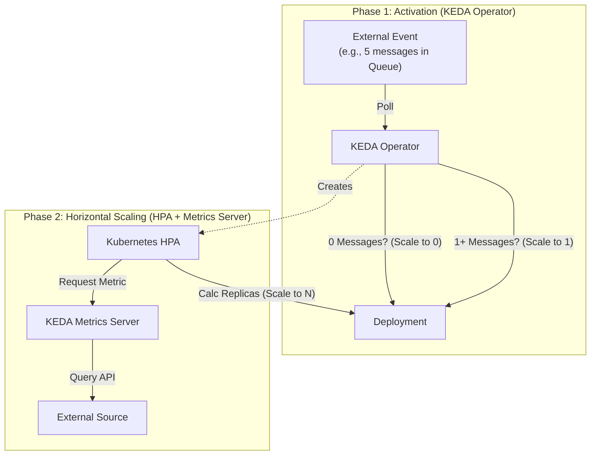
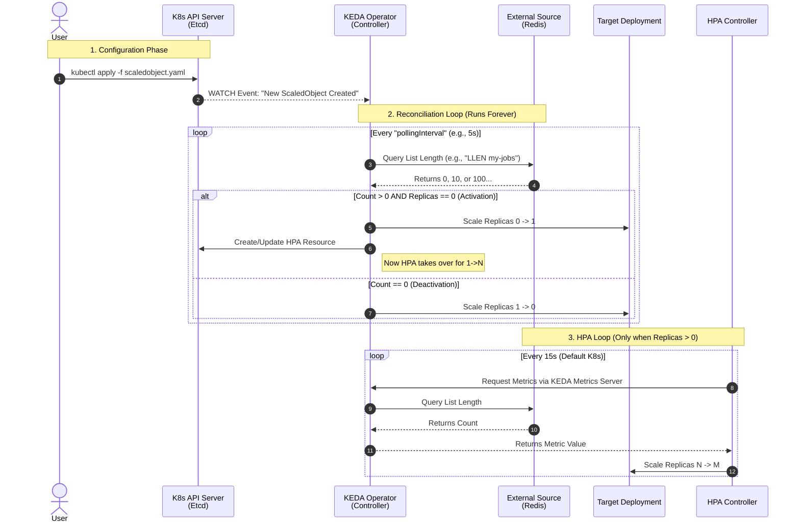

# KEDA (Kubernetes Event-driven Autoscaling)

## 1. Executive Summary

**The Problem**: Standard Kubernetes HPA scales primarily on CPU & Memory. This is **Reactive**. By the time CPU spikes, your queue might already have 10,000 pending jobs, meaning you are already behind.

**The Solution**: KEDA scales based on **External Events** (Queue Depth, Kafka Lag, SQL Query Results). It is **Proactive**.

**The Superpower**: **Scale to Zero**.
If there are 0 items in the queue, KEDA shuts down your deployment completely (0 pods). Standard HPA cannot do this (minimum is usually 1).

---

## 2. Architecture Deep Dive

KEDA is not just a "Metrics Adapter"; it is a **Systems Controller** that orchestrates two distinct lifecycles: **Activation (0 ↔ 1)** and **Scaling (1 ↔ N)**.

### 2.1. The Components
KEDA relies on three key components to function:

1.  **KEDA Operator (Agent)**:
    *   **Role**: The "Brain". It manages the CRDs (`ScaledObject`, `ScaledJob`, `TriggerAuthentication`).
    *   **Function**: It continuously runs a polling loop against the external event source (e.g., polling SQS every 30s).
    *   **Responsibility**: It is the **ONLY** component responsible for scaling from **0 to 1** and **1 to 0**.
2.  **KEDA Metrics Server**:
    *   **Role**: The "Bridge". It implements the Kubernetes External Metrics API.
    *   **Function**: When the HPA asks "What is the current queue length?", the KEDA Metrics Server translates that request into a call to the external provider (SQS/Kafka).
    *   **Responsibility**: It feeds data to the HPA for scaling from **1 to N**.
3.  **Admission Webhooks**:
    *   Validates CRD configurations to prevent misconfiguration (e.g., preventing invalid Polling intervals).

### 2.2. The Scaling Workflow (0 → 1 → N)
KEDA splits scaling into two phases. This is the most critical concept to understand for debugging.



1.  **Phase 1: Activation (The Cold Start)**
    *   The **KEDA Operator** polls the external source.
    *   If Queue Depth = 0: It manually sets the Deployment replicas to 0. (HPA is deactivated).
    *   If Queue Depth > 0: It manually scales Deployment to 1. **Then it hands control over to the HPA.**
2.  **Phase 2: HPA Scaling (The Load)**
    *   Once the deployment is at 1 replica, the **HPA** takes over.
    *   The HPA polls the **KEDA Metrics Server** to get the current metric value.
    *   HPA calculates replicas: `ceil(currentMetricValue / targetMetricValue)`.

### 2.3. ScaledObject vs. ScaledJob (Architecture Decision)
Not all workloads should use a `Deployment`.

| Feature | ScaledObject (Deployment) | ScaledJob (Kubernetes Job) |
| :--- | :--- | :--- |
| **Workload Type** | **Continuous Listeners**. Web servers, Consumers polling a queue. | **One-off Tasks**. Video transcoding, large data batch processing. |
| **Logic** | Scales the *number of running pods*. | Creates *one K8s Job* per event. |
| **Scale Down** | **Dangerous**. HPA might kill a pod while it is processing a message. requires `preStop` hooks for graceful shutdown. | **Safe**. The Pod runs until completion (Success/Failure). It is never killed prematurely by autoscaling. |
| **Max Scale** | Limited by `maxReplicaCount`. | Limited by `parallelism` and `maxPollingInterval`. |
| **Best For** | High-throughput, short-lived messages (RabbitMQ, HTTP). | Long-running (>5 min) expensive tasks (Video rendering). |

### 2.4. Authentication Architecture (`TriggerAuthentication`)
KEDA decouples credentials from the scaling logic.
*   **TriggerAuthentication**: Namespace-scoped. Used by ScaledObjects in the same namespace.
*   **ClusterTriggerAuthentication**: Cluster-scoped. Used by ScaledObjects across all namespaces (e.g., a shared Kafka cluster for the whole company).
*   **Pod Identity / IRSA**: The preferred architectural pattern. KEDA assumes the IAM role of the Service Account to avoid handling secrets altogether.

---

## 3. Production Patterns (The "Big 3")

### Pattern A: The Queue Consumer (The Classic)
**Use Case**: Image processing, video transcoding, email sending.
*   **Trigger**: Redis List, AWS SQS, Kafka, RabbitMQ.
*   **Behavior**:
    *   0 messages → 0 Pods.
    *   100 messages → 1 Pod.
    *   10,000 messages → 50 Pods.
*   **Value**: You stop paying for idle workers when no jobs exist.

### Pattern B: The Cron Scaler (The Predictable Spike)
**Use Case**: A trading app that opens at 9:30 AM EST.
*   **Trigger**: Cron (Linux Crontab syntax).
*   **Behavior**: "At 9:00 AM, force scale to 20 replicas. At 4:00 PM, scale back to 2."
*   **Value**: Prevents "Cold Start" lag. Pods are pre-warmed before users arrive.

### Pattern C: The SQL Scaler (The Legacy Bridge)
**Use Case**: A legacy monolith that uses a Postgres table as a "Job Queue" (`SELECT * FROM jobs WHERE status = 'pending'`).
*   **Trigger**: SQL Query row count (`SELECT COUNT(*)...`).
*   **Behavior**: Count > 50 → Scale Up.
*   **Value**: Modernizes legacy apps without rewriting their database logic.

---

## 4. Architectural Deep Dive: Design Decisions

### 4.1. The Database Scaler Debate
**Intuition**: "Is it wise to allow KEDA to connect to the DB directly? Is this legacy?"
**Verdict**: **Yes, it is largely an anti-pattern.**

1.  **The Danger**:
    *   **Performance Hit**: `SELECT COUNT(*)` on a large table is expensive. Polling your Production Primary DB every 5 seconds steals IOPS from user transactions.
    *   **Thundering Herd**: If KEDA scales your app to 100 pods, those 100 pods opens 100 DB connections immediately, potentially DDoSing your database.
    *   **Security**: You must share DB credentials with the KEDA Operator.
2.  **The Modern Approach (Prometheus Wrapper)**:
    *   Instead of KEDA polling the DB, your Application (or a sidecar) exposes a metric: `job_queue_depth{status="pending"}`.
    *   KEDA scales based on the **Prometheus Scaler**.
    *   *Benefit*: Decoupling and Caching. KEDA talks to Prometheus, not your sensitive DB.
3.  **Why use SQL Scaler?** Pragmatism. It helps migrate 15-year-old monoliths to Kubernetes without a 2-year rewrite to Kafka. **Use only for migration paths.**

### 4.2. The S3 / File Upload Model
**Intuition**: "Does KEDA watch (list) files in a bucket? Or use EventBridge?"
**Verdict**: **Do NOT use the polling model. Use the Queue-Based pattern.**

1.  **The Naive Way (Polling)**:
    *   Running `aws s3 list-objects` every 10 seconds.
    *   *Why it fails*: **Cost**. AWS charges for every LIST request. Scanning huge buckets is also slow (latency).
2.  **The Production Way (S3 → SQS → KEDA)**:
    *   **The Workflow**: User uploads file → S3 Event Notification → SQS Queue (`{"event": "ObjectCreated"}`).
    *   **KEDA**: Watches the **SQS Queue Depth**, not the bucket.
    *   *Benefit*: Cost-efficient, faster, and reliable (retries via SQS visibility timeouts).

---

## 5. Enterprise Best Practices (Governance & Stability)

In an interview, do not just say "I set up KEDA." Say "**I set up KEDA safely.**"

| Category | Best Practice | The "Why" (The Risk) |
| :--- | :--- | :--- |

| **Security** | **TriggerAuthentication** | **Anti-Pattern**: Hardcoding AWS Keys/DB Passwords in YAML. <br>**Fix**: `TriggerAuthentication` CRD references Kubernetes Secrets or AWS IAM Roles (IRSA), keeping `ScaledObject` clean. |
| **Safety** | **maxReplicaCount** | **The Bankruptcy Stopper**. A bug in Producer pushes 1M jobs → KEDA scales to 5,000 pods → Cluster Crash / Huge Bill. <br>**Fix**: Always cap replicas based on DB connection limits. |
| **Stability** | **cooldownPeriod** | **Prevent Flapping**. Queue goes 10→0→10→0. KEDA thrashing causes CPU spikes. <br>**Fix**: Set `cooldownPeriod: 300` (5 mins). Wait before scaling down to zero. |
| **Reliability** | **Fallback Strategy** | **What if Datadog is down?** If KEDA is blind, it might scale to 0 during peak. <br>**Fix**: `fallback` section: "If metric is unreachable, force replica count to 10 until restored." |

---

## 6. What Can Trigger KEDA? (The Catalog)

Enterprises use KEDA to bridge the gap between "Business Signals" and "Infrastructure."

*   **Messaging (The Worker Pattern)**: AWS SQS, Kafka (Lag), RabbitMQ, Azure Service Bus.
*   **Databases (The Legacy Bridge)**: PostgreSQL, MySQL, MongoDB, Redis.
*   **Observability (The Traffic Burst)**: Prometheus (Most Common), Datadog, AWS CloudWatch, New Relic.
*   **Storage (The Batch Processor)**: AWS S3 (via Queue), Azure Blob Storage.

---

---

## 7. Appendix: The Metrics Server Gap (Why KEDA?)
**"Why do I need KEDA? Can't I just use the Kubernetes Metrics Server?"**

No. The Metrics Server is designed for **"Resource Stability,"** not "Application Scaling."

### 7.1. What is the Metrics Server?
It is a lightweight, cluster-wide aggregator of resource usage data (CPU & Memory).
*   **Purpose**: Enabling HPA (CPU/RAM) and `kubectl top`.
*   **Philosophy**: "Narrow and Deep." It is NOT a monitoring solution.

### 7.2. What it Collects (and What it Ignores)
It intentionally filters out most data to remain lightweight.

| Metric Type | Metrics Server (Standard HPA) | Real Monitoring (Prometheus / Datadog) |
| :--- | :--- | :--- |
| **CPU** | ✅ Yes (mili-cores) | ✅ Yes |
| **Memory** | ✅ Yes (MiB) | ✅ Yes |
| **Network** | ❌ No | ✅ Yes (Packet/sec, Bandwidth) |
| **Disk I/O** | ❌ No | ✅ Yes (IOPS, Latency) |
| **Application** | ❌ **No** (Queue Depth, HTTP RPS) | ✅ **Yes (This is why you need KEDA)** |
| **History** | ❌ No (Real-time only) | ✅ Yes (Historical Graphs) |

### 7.3. "Out of the Box" Availability
Distribution matters.
*   **GKE / AKS**: ✅ Pre-installed & Managed.
*   **K3s**: ✅ Included (as an Addon).
*   **EKS / Standard Kubeadm**: ❌ **Not installed**. You must install it manually (Bitnami Helm Chart or Official Manifests).

> **Key Takeaway**: KEDA bridges the gap. It reads the "Real Monitoring" metrics (bottom right) and translates them so the HPA *thinks* they are simple Resource metrics.

### 7.4. Critical Clarifications (Metrics Server, HPA Config, & Vertical Scaling)
To explicitly answer common architectural questions:

1.  **What is the KEDA Metrics Server & how is it different?**
    *   The **KEDA Metrics Server** implements the **External Metrics API**. It exists *alongside* the standard Kubernetes Metrics Server (which implements the `Resource Metrics API`).
    *   **Difference**: Standard Metrics Server collects internal cluster stats (CPU/Mem) from Kubelets. KEDA Metrics Server collects external stats (Queue Length, DB Rows) by querying third-party APIs (AWS cloudwatch, Kafka, MySQL).
    *   They do not conflict; they serve different API endpoints to the master node.

2.  **How is the HPA configured to use KEDA?**
    *   **Standard HPA**: configured with `type: Resource` (targeting CPU/Memory).
    *   **KEDA-Managed HPA**: The KEDA Operator automatically generates an HPA manifest. In this manifest, it sets `metrics.type: External`. This tells the HPA controller: *"Don't ask the standard metrics server. Ask the implementation of the External Metrics API (which is KEDA)."*
    *   *Note*: You rarely touch this HPA config manually; KEDA manages it for you via the `ScaledObject`.

3.  **Horizontal vs. Vertical Scaling?**
    *   KEDA performs **Horizontal Scaling only** (Adding/Removing Pods).
    *   It does **not** perform Vertical Scaling (increasing CPU/RAM limits of existing pods).
    *   *Why?* Vertical scaling usually requires restarting pods (disruptive), whereas horizontal scaling is seamless. For vertical scaling, look into the **Vertical Pod Autoscaler (VPA)** project.

----

## 8. Deep Dive: Architecture & Internals

To truly master KEDA, you must understand what happens under the hood when you `kubectl apply` a ScaledObject.

### 8.1. The Components: Brain vs. Gatekeeper

| Component | AKA | Responsibility | Triggered By |
| :--- | :--- | :--- | :--- |
| **Operator** | "The Brain" | The central controller that manages the lifecycle of KEDA resources. Handles the **0 ↔ 1** scaling magic. | Polling loop (Reconcile) or Watch Events. |
| **Admission Webhook** | "The Gatekeeper" | Validates or Mutates KEDA resources before they are saved to etcd. Prevents you from breaking the cluster. | API Server (whenever you run `kubectl apply`). |
| **Metrics Server** | "The Translator" | Adapts external metrics (RabbitMQ, Kafka) into the standard Kubernetes Metrics API so the HPA can read them. | HPA Controller (polling). |

#### A. The Admission Webhook (The Gatekeeper)
Contrary to popular belief, the Operator does **NOT** invoke the Webhook. The Kubernetes API Server does.

1.  **Mutating (The Editor)**: Can change resources on the fly (e.g., injecting sidecars or default values).
2.  **Validating (The Guard)**: Checks rules (e.g., "Reject any ScaledObject targeting a Deployment already managed by another HPA"). This prevents "flapping" where two controllers fight over the replica count.

> **Why is this in the Helm Chart?**
> Setting up webhooks manually is hard because they strictly require **TLS**. Helm automates generating the self-signed certificate and injecting the CA bundle so the API server trusts the webhook.

#### B. The Operator (The Brain)
The Operator is a standard Kubernetes Controller (written in Go) that runs a persistent `Reconcile()` loop.

*   **0 ↔ 1 Scaling**: The Operator is **solely responsible** for scaling your app from 0 to 1 and back to 0. It checks the event source directly.
*   **1 ↔ N Scaling**: Once the app is active (1 replica), the Operator creates a standard Kubernetes **HPA**. It then steps back and lets the HPA handle scaling from 1 to N.

#### C. Visualizing the Reconciliation Loop

This diagram illustrates exactly how the KEDA Operator interacts with the Kubernetes API and the `ScaledObject` CRD.



---

### 8.2. The Scaling Lifecycle (Sequence of Events)

Here is the exact step-by-step flow of a scaling event:

| # | Action | Actor | Detail |
| :--- | :--- | :--- | :--- |
| **1** | **Apply** | User / CI | You apply a `ScaledObject`. The Webhook validates it; API Server saves it. |
| **2** | **Observe** | Operator | The Operator sees the new resource and starts "polling" the event source (e.g., RabbitMQ). |
| **3** | **Activation** | Operator | Event source has data! Operator changes Deployment `replicas: 0 -> 1`. |
| **4** | **HPA Creation** | Operator | Operator creates a standard HPA and tells it: *"Ask the KEDA Metrics Server for the numbers."* |
| **5** | **Scaling Out** | HPA + Metrics Server | **(1 -> N)**: HPA asks Metrics Server → Metrics Server asks Operator → HPA scales pods. |
| **6** | **Scaling In** | HPA | **(N -> 1)**: Traffic drops. HPA reduces pods until 1. |
| **7** | **Deactivation** | Operator | **(1 -> 0)**: Traffic is 0 for the `coolingPeriod`. Operator scales Deployment from 1 to 0. |

---

### 8.3. Admission Webhooks vs. Helm Hooks

It is common to confuse these two. They are fundamentally different:

| Feature | Helm Hook | Admission Webhook |
| :--- | :--- | :--- |
| **Purpose** | Runs a task at a specific stage of Helm install (e.g., DB migration). | Intercepts **every** Kubernetes API request (even `kubectl` ones). |
| **Trigger** | `helm install` / `helm upgrade` | Any Create/Update on the Cluster. |
| **Duration** | Ephemeral (Job/Pod that exits). | Long-running Service (must be 24/7). |

---

### 8.4. Permissions: ServiceAccounts & RBAC

Because KEDA needs to modify your Deployments and read your Secrets, it requires high-level privileges.

1.  **ServiceAccount**: The KEDA Pods run under a specific SA (usually `keda-operator`).
2.  **ClusterRole**: Grants "verbs" like `patch`, `update`, and `get` for heavy resources like `Deployments`, `StatefulSets`, and `HPAs`.
3.  **ClusterRoleBinding**: Binds the SA to the ClusterRole, giving it power across **all namespaces**.

### 8.5. Code Perspective (For Developers)

If you were writing a **Mutating Webhook** in Python, logic acts as a middleware:

```python
# Pseudo-code for a Mutating Webhook
@app.route('/mutate', methods=['POST'])
def mutate():
    request_data = request.get_json()
    
    # Logic: If the pod is missing a specific label, add it.
    patch = [{"op": "add", "path": "/metadata/labels/managed-by", "value": "my-webhook"}]
    
    return jsonify({
        "response": {
            "allowed": True,
            "patchType": "JSONPatch",
            "patch": base64.encode(patch)
        }
    })
```

If you were writing the **Operator** in Go, it follows the Controller Runtime pattern:

```go
func (r *ScaledObjectReconciler) Reconcile(ctx context.Context, req ctrl.Request) (ctrl.Result, error) {
    // 1. Fetch the ScaledObject
    // 2. Poll the external trigger (Kafka/RabbitMQ/etc)
    
    // 3. Activation Logic (0 -> 1)
    // If external_metric > 0 and current_replicas == 0:
    //    Scale Deployment to 1
    
    // 4. HPA Management (1 -> N)
    // Ensure an HPA exists pointing to the KEDA Metrics Server
    
    return ctrl.Result{RequeueAfter: pollingInterval}, nil
}
```

---

## 9. Hands-on Lab: Scaling from 0 to N with Redis

This lab demonstrates how KEDA watches a Redis list and scales workers accordingly.

### Step 1: Install KEDA
Run these commands to ensure the KEDA control plane is ready.

```bash
# 1. Add the Helm repo
helm repo add kedacore https://kedacore.github.io/charts
helm repo update

# 2. Install KEDA Controller
helm install keda kedacore/keda --namespace keda --create-namespace

# 3. Verify
kubectl get pods -n keda
```
*You should see `keda-operator` and `keda-metrics-apiserver` running.*

### Step 2: Deploy the Infrastructure (Redis)
We use Redis as our **Event Source**. Note that we are using it as a **Queue** (using the `List` data structure), not just a cache.

```yaml
# manifests/redis.yaml
apiVersion: v1
kind: Pod
metadata:
  name: redis
  labels:
    app: redis
spec:
  containers:
  - name: redis
    image: redis:alpine
    ports:
    - containerPort: 6379
---
apiVersion: v1
kind: Service
metadata:
  name: redis-svc
spec:
  selector:
    app: redis
  ports:
  - port: 6379
```

```bash
kubectl apply -f manifests/redis.yaml
```

### Step 3: Deploy the Worker (The "Serverless" App)
This deployment starts with **0 replicas**. It is completely "cold" until work arrives.

```yaml
# manifests/worker.yaml
apiVersion: apps/v1
kind: Deployment
metadata:
  name: redis-worker
spec:
  replicas: 0  # <--- Starts at Zero!
  selector:
    matchLabels:
      app: worker
  template:
    metadata:
      labels:
        app: worker
    spec:
      containers:
      - name: worker
        image: busybox
        command: ["sh", "-c", "echo 'Processing job...'; sleep 30"]
```

```bash
kubectl apply -f manifests/worker.yaml
```

### Step 4: The Logic (ScaledObject)
This is the bridge connecting the queue to the workers.

```yaml
# manifests/keda-redis-worker.yaml
apiVersion: keda.sh/v1alpha1
kind: ScaledObject
metadata:
  name: redis-scaledobject
spec:
  scaleTargetRef:
    name: redis-worker
  pollingInterval: 5   # Check Redis every 5 seconds
  cooldownPeriod:  30  # Wait 30s after queue is empty to scale back to 0
  minReplicaCount: 0   # Allow scaling to zero
  maxReplicaCount: 5   # Safety cap
  triggers:
  - type: redis
    metadata:
      address: redis-svc.default.svc.cluster.local:6379
      listName: my-jobs
      listLength: "5"  # Target: 5 items per pod
```

```bash
kubectl apply -f manifests/keda-redis-worker.yaml
```

### Step 5: Run the Test (Generate Load)

1.  **Watch the scaling**:
    ```bash
    kubectl get pods -w
    ```
2.  **Inject 20 jobs**: We use `redis-cli LPUSH` to add 20 items to the `my-jobs` list.
    ```bash
    kubectl exec -it redis -- sh -c 'for i in $(seq 1 20); do redis-cli lpush my-jobs "job-$i"; echo "Added job-$i"; done'
    ```

**Result**: Within 5-10 seconds, KEDA detects 20 items. Since `listLength` is 5, it calculates `20 / 5 = 4 Replicas`. You will see 4 worker pods spin up immediately.

---

### Step 6: Verify "Scale to Zero"
To simulate the workers "finishing" the work, we empty the queue.

```bash
kubectl exec -it redis -- redis-cli del my-jobs
```

**Result**: After the `cooldownPeriod` (30s) expires, the Operator will see 0 items and scale the deployment back down to **0 replicas**.

---

## 10. FAQ & Interview Prep

### Q: Is Redis a Queue or a Cache?
**A:** Redis is an **In-memory Data Store**. 
*   It is a **Cache** if you use `SET/GET` (Key-Value).
*   It is a **Queue** if you use `LPUSH/RPOP` (Lists) or **Streams**.
In KEDA, we almost always use it as a **Queue** because we need to measure the "length" of pending work.

### Q: Where does the `ScaledObject` actually "run"?
**A:** It doesn't "run" anywhere. It is a **passive resource** (CRD) in etcd. The **KEDA Operator** is the active process that watches it. When you apply it, the Operator's Reconcile Loop wakes up and starts a Polling Loop (Ticker) based on your `pollingInterval`.

### Q: Does KEDA replace the HPA?
**A:** No. KEDA **manages** the HPA. For 1 to N scaling, KEDA creates a standard HPA and serves as the metrics provider. KEDA is only "hands-on" for the **0 ↔ 1** transition, which the native HPA cannot do on its own.

### Q: Can KEDA do Vertical Scaling (CPU/RAM)?
**A: No.** KEDA is strictly designed for **Horizontal Scaling** (adding/removing Pods) based on events.
*   **Vertical Scaling** (Upsizing Pods): Use the **Kubernetes Vertical Pod Autoscaler (VPA)**.
*   *Note*: You can use KEDA (for # of pods) and VPA (for size of pods) together, but ensure their policies don't conflict (e.g., KEDA scaling up while VPA restarts pods to resize them).

### Q: When KEDA scales to 0, is the HPA deleted?
**A: No.** The HPA resource remains in the cluster, but KEDA effectively **deactivates** it.
*   The KEDA Operator manually sets the Deployment replicas to 0.
*   It modifies the HPA configuration (or sets conditions like `ScalingActive: False`) so the HPA stops calculating replicas.
*   When activity returns (1+ messages), KEDA scales the Deployment to 1, reactivates the HPA, and lets the HPA handle the rest (1 → N).

### Q: Wait, isn't HPA only for CPU/Memory? How does it see "Queue Length"?
**A:** This is a common misconception!
*   **Standard HPA**: Uses the `Resource Metrics API` (CPU/Memory).
*   **KEDA HPA**: Uses the `External Metrics API`.
*   **The Magic**: The HPA asks the **Kubernetes API** for `rabbitmq_queue_length`. The KEDA Metrics Adapter intercepts this call, checks RabbitMQ, and returns the number. The HPA then does the math (`Current / Target`) and updates the deployment.
*   *Correction*: The KEDA Operator does NOT tell the HPA "scale to 10". The HPA calculates that itself based on the data KEDA provides.


---

## 11. Advanced: The KEDA Ecosystem (CRD Breakdown)

While `ScaledObject` is the bread-and-butter of KEDA, there are four main Custom Resource Definitions (CRDs) you must know to design robust systems.

### 11.1. ScaledObject (The Standard)
*   **Target**: `Deployment`, `StatefulSet`, or `CustomResource`.
*   **Mechanism**: Creates a standard Kubernetes **HPA**.
*   **Use Case**: High-throughput, low-latency processing.
*   **Example**: An SQS consumer that picks up a message, processes it in 100ms, and reuses the connection for the next one.
*   **ALERTA (The "Gotcha")**: **Aggressive Scale Down**. If KEDA scales from 10 to 5 replicas, it kills 5 random pods. If a pod was processing a 10-minute video upload, that work is **killed instantly**.

### 11.2. ScaledJob (The Batch Processor)
*   **Target**: `Job`.
*   **Mechanism**: **Does NOT use HPA**. The KEDA Operator manually spawns a Kubernetes `Job` for every event (or batch of events).
*   **Use Case**: Long-running, heavy, or "run-to-completion" tasks.
*   **Example**: Video Transcoding. One video upload = One Kubernetes Job.
*   **Why use it?**: **Safety**. If the queue empties while 50 jobs are running, KEDA will **NOT** kill them. It waits for them to finish naturally.
*   **The "Gotcha"**: **Cold Start Latency**. You pay the startup tax (pulling image, starting JVM) for *every single item*. Do not use this for tasks that complete in < 5 seconds.

### 11.3. TriggerAuthentication (The Security Layer)
*   **Scope**: **Namespaced** (Local).
*   **Use Case**: A `ScaledObject` in the `payments` namespace needs credentials to read from a secure AWS SQS queue.
*   **Why?**: **Decoupling**. You can rotate secrets in the `TriggerAuthentication` object without editing/restarting your Deployment.

**Example Usage**:
```yaml
apiVersion: keda.sh/v1alpha1
kind: TriggerAuthentication
metadata:
  name: keda-aws-creds
  namespace: default
spec:
  secretTargetRef:
  - parameter: awsAccessKeyID     # The key KEDA looks for
    name: my-k8s-secret           # The K8s Secret name
    key: AWS_ACCESS_KEY_ID        # The key inside the Secret
  - parameter: awsSecretAccessKey
    name: my-k8s-secret
    key: AWS_SECRET_ACCESS_KEY
---
apiVersion: keda.sh/v1alpha1
kind: ScaledObject
metadata:
  name: aws-sqs-scaledobject
spec:
  scaleTargetRef:
    name: my-deployment
  triggers:
  - type: aws-sqs-queue
    metadata:
      queueURL: https://sqs.us-east-1.amazonaws.com/123/my-queue
      awsRegion: "us-east-1"
    authenticationRef:
      name: keda-aws-creds       # <--- simple reference
```

### 11.4. ClusterTriggerAuthentication (The Global Passport)
*   **Scope**: **Cluster-wide** (Global).
*   **Use Case**: You are the Platform Admin. You want to give every team read-access to a shared central Kafka or Prometheus instance.
*   **Why?**: **DRY (Don't Repeat Yourself)**. Prevents copying the same Datadog API key into 50 different namespaces.

---

### 11.5. The "Lead Engineer" Decision Matrix

Use this table to decide between `ScaledObject` (Deployment) and `ScaledJob` (Job):

| Feature | ScaledObject (Deployment) | ScaledJob (K8s Job) |
| :--- | :--- | :--- |
| **Processing Model** | **"Daemon"** (Worker stays alive, pulls new work). | **"One-Shot"** (Worker starts, does 1 task, dies). |
| **Startup Cost** | Paid once (at scale up). | Paid for **every single event**. |
| **Scale Down** | **Aggressive**. Can kill work-in-progress. | **Safe**. Waits for completion. |
| **Throughput** | **High** (Reuses connections). | **Low** (Connection overhead per task). |
| **Best For** | Web requests, Fast Queue items (< 1 min). | AI Training, ETL, Video Rendering (> 5 mins). |


---

## 12. Deep Dive: AWS IAM & Authentication Internals

Understanding how KEDA authenticates with cloud providers (like AWS) is critical for security and performance.

### 12.1. The Token Exchange (The "Handshake")
When using **IRSA** (IAM Roles for Service Accounts), KEDA performs a seamless token exchange:

1.  **K8s Token (OIDC)**: Kubelet injects a signed JWT into the Pod at `/var/run/secrets/eks.amazonaws.com/serviceaccount/token`. This proves "I am Pod X".
2.  **AWS Token (STS)**:
    *   KEDA (or your App) reads this JWT.
    *   It calls AWS STS `AssumeRoleWithWebIdentity`.
    *   AWS verifies the JWT signature and returns **Temporary Credentials** (Access Key, Secret Key, Session Token).

### 12.2. Who Caches the Token? (The Performance Secret)
**Q: How does KEDA poll SQS every 5 seconds without spamming AWS STS?**
**A: The AWS SDK (inside KEDA) caches it.**

*   **Logic**: KEDA checks its process memory: *"Do I have a valid STS session?"*
    *   **Yes**: Use it. (Zero network overhead).
    *   **No**: Call STS, get new creds, and cache them (default 1 hour).
*   **Result**: High-frequency polling (every 5s) with low-frequency auth overhead (every 1hr).

### 12.3. TriggerAuthentication Reuse Modes
When multiple ScaledObjects use the same credentials, KEDA behaves differently based on your configuration:

| Mode | `identityOwner:` | Description | Reuse? |
| :--- | :--- | :--- | :--- |
| **Superuser Pattern** | `keda` | The KEDA Operator's **own Service Account** assumes the role. | **Yes.** One client in memory is reused for all 50 ScaledObjects. Efficient but dangerous (Root access). |
| **Zero Trust Pattern** | `workload` | KEDA impersonates the **Target Deployment's** Service Account. | **No.** KEDA creates a separate STS session for each unique Role. Secure (least privilege), but higher memory usage. |

### 12.4. ClusterTriggerAuthentication: The Risk
**The Gotcha**: If you create a `ClusterTriggerAuthentication` with static credentials (Secret), **ANY** user in **ANY** namespace can reference it.
*   **Scenario**: A dev in `namespace: chaos` references your Prod Auth and drains your SQS queue.
*   **The Fix**: Only use Cluster-level auth with **IAM Roles (IRSA)**. If the dev's Pod doesn't have the IAM trust relationship, the chain breaks, and they cannot access the data even if they reference the KEDA object.


---

## 13. Production War Stories: 8 Common KEDA Gotchas

### 13.1. The "Thundering Herd" (Downstream DDoS)
*   **The Gotcha**: KEDA scales fast. If you dump 50,000 messages into a queue, KEDA might scale your workers from 0 to 500 in seconds. These 500 pods immediately open DB connections.
*   **The Impact**: You accidentally DDoS your own Database or internal APIs, causing a cascading outage.
*   **Lead Mitigation**:
    *   Always set `maxReplicaCount`. Calculate it: `(Max DB Connections / Connections Per Pod)`.
    *   Implement **Rate Limiting** inside the worker application code, not just at the infrastructure level.

### 13.2. The "HPA Conflict" (Ownership Wars)
*   **The Gotcha**: A developer adds a standard Kubernetes HorizontalPodAutoscaler (HPA) to a deployment that is also managed by a KEDA ScaledObject.
*   **The Impact**: The two controllers fight. KEDA sets replicas to 0 (empty queue), and native HPA sets it back to 1 (min replicas). The deployment "flaps" constantly.
*   **Lead Mitigation**:
    *   KEDA creates and owns the HPA resource. You must **delete any existing HPA YAMLs** from your Git repo before applying KEDA.
    *   *Interview Tip*: "I enforce this via OPA Gatekeeper policies to reject any HPA targeting a resource already claimed by KEDA."

### 13.3. The "Scale-to-Zero" Cold Start
*   **The Gotcha**: You scale a web service to 0 because traffic is low. The next user makes a request. It fails because the pod takes 5 seconds to boot, but the Load Balancer timeout is 2 seconds.
*   **The Impact**: The first few users always experience errors (503s) or massive latency.
*   **Lead Mitigation**:
    *   **Only scale to zero for asynchronous background workers** (Queue consumers).
    *   Never scale to zero for synchronous HTTP APIs unless you are using KEDA with an "Activator" pattern (like Knative) that can hold the request. For standard KEDA, keep `minReplicaCount: 1`.

### 13.4. The "Long-Running Task" Kill (Data Loss)
*   **The Gotcha**: KEDA uses `ScaledObject` (Deployments) by default. When the queue drops from 100 to 50, KEDA shrinks the HPA. Kubernetes kills 50 random pods.
*   **The Impact**: If those pods were 90% done processing a 10-minute video, that work is lost. The message returns to the queue (if you handled ACKs correctly) and is processed again—wasting compute.
*   **Lead Mitigation**:
    *   **Graceful Shutdown**: Your app must handle `SIGTERM`. It should stop accepting new work and finish the current item within `terminationGracePeriodSeconds`.
    *   **ScaledJob**: If the task is truly long and un-interruptible, do not use `ScaledObject`. Use `ScaledJob` (Kubernetes Jobs), which guarantees "run to completion."

### 13.5. Authentication Sprawl & Security
*   **The Gotcha**: Developers copy-paste Redis passwords or AWS Access Keys directly into `ScaledObject` metadata.
*   **The Impact**: Credentials leak in Git history. Rotating secrets requires redeploying every single ScaledObject.
*   **Lead Mitigation**:
    *   **TriggerAuthentication**: Enforce usage of this CRD. It decouples auth from logic.
    *   **Identity Reuse**: Use `ClusterTriggerAuthentication` for shared platform resources (e.g., a central Kafka cluster) so you rotate keys in one place only.
    *   **Workload Identity**: Prefer IAM Roles (IRSA) over static secrets whenever the provider supports it.

### 13.6. The "API Rate Limit" (The Vendor Tax)
*   **The Gotcha**: You have 50 microservices scaling based on Datadog metrics. KEDA polls Datadog API for every single one every 30 seconds.
*   **The Impact**: Datadog rate-limits your API key. KEDA goes blind. Scaling stops.
*   **Lead Mitigation**:
    *   **Increase Polling Interval**: Change `pollingInterval` from default 30s to 60s or 120s for non-critical apps.
    *   **Prometheus Proxy**: Scrape Datadog metrics into a local Prometheus instance and have KEDA scale off the local Prometheus (free) instead of hitting the external API.

### 13.7. The "Zombie Metric" (Stale Data)
*   **The Gotcha**: You scale based on a Prometheus metric. The Prometheus scraper crashes, so the metric value freezes at "High Load."
*   **The Impact**: KEDA thinks load is high and scales out to max replicas ($$$). It stays there forever because the metric never updates.
*   **Lead Mitigation**:
    *   **Liveness Probes**: Ensure your metric source (Prometheus) has robust monitoring.
    *   **Fallback Config**: Configure the `fallback` section in ScaledObject. *"If metric source is unresponsive for X minutes, revert to Y replicas."*

### 13.8. The "Missing Metrics" (Namespace Isolation)
*   **The Gotcha**: Your KEDA operator is in the `keda` namespace. It tries to scale an app in `finance` namespace using a metric from a `TriggerAuthentication` in `security` namespace.
*   **The Impact**: Permission denied. KEDA fails silently or logs errors deep in the operator logs.
*   **Lead Mitigation**:
    *   **Understand the Scope**. `TriggerAuthentication` must usually be in the **same namespace** as the `ScaledObject`, unless you use `ClusterTriggerAuthentication`.