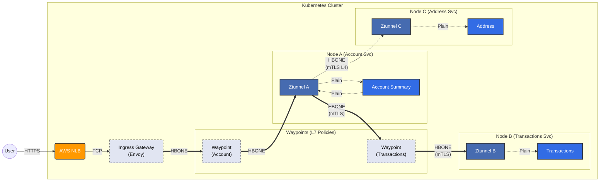

# Network & Mesh Deep Dive: Fargate vs. Ambient

#### 1. The Latency Question: "Same Node" vs. "Separate Nodes"
*   **Same Node (localhost/bridge)**: Traffic stays inside the Linux Kernel of that one machine. Moves memory-to-memory. Latency < 0.1ms.
*   **Separate Nodes (The Network)**: Traffic must leave the VM, hit the AWS Nitro Card, go to the Physical Network, travel to the other host, and come back. Latency: 0.5ms - 2.0ms.

**The Fargate Reality**: Since Fargate forces 1 Pod = 1 Node, **every single communication** in a Fargate cluster is "Separate Node" communication. You never get the "localhost" speed advantage.

#### 2. The Conflict: "Sidecar-less" (Ambient) vs. Fargate
**Hard Truth**: Standard "Sidecar-less" Mesh (Ambient/Cilium) does **NOT** work on EKS Fargate.

**Why?**
*   **Ambient Architecture**: Relies on a `ztunnel` agent running as a **DaemonSet** on the Node to intercept L4 traffic.
*   **Fargate Restriction**: You do not own the Node. AWS forbids DaemonSets and privileged network interception (eBPF) on the underlying host.
*   **Result**: There is no place for the shared ztunnel to live.

#### 3. The Solution: How to Mesh on Fargate
If you strictly need Fargate, you have two options:

*   **Option A: The "Sidecar ztunnel" (The Compromise)**
    *   Since we can't share a ztunnel on the host, we must put a tiny ztunnel inside **every pod** (technically a sidecar).
    *   *Why bother?* It is much lighter (Rust, ~10MB RAM) than the full Envoy sidecar (50MB+ RAM).
*   **Option B: The L7 Waypoint**
    *   The L7 part (Waypoint Proxy) is just a standard Deployment, so it works on Fargate.
    *   *The Gotcha*: You add an extra "hop", increasing latency further.

#### 4. Summary for Interviews
> "On EKS Fargate, true 'sidecar-less' meshes like Cilium or Standard Istio Ambient do not work because they require DaemonSets and privileged kernel access (eBPF) to intercept traffic on the node, which Fargate prohibits.
>
> To run a Mesh on Fargate, we effectively have to use the **Sidecar Pattern** (either the full Envoy sidecar or a lightweight ztunnel sidecar)."


#### 5. The Ingress Gateway (North-South Traffic)

The **Ingress Gateway** in Istio Ambient Mesh acts as your cluster's "Reception Desk."

*   **East-West Traffic**: Handled by **Ztunnels** (L4) and **Waypoints** (L7) inside the mesh.
*   **North-South Traffic**: Handled by the **Ingress Gateway** (a specialized Envoy proxy) at the edge.

In the Ambient model, this is almost always managed via the **Kubernetes Gateway API**, which replaces the older Istio `Gateway` and `VirtualService` Custom Resources.

---

### Connecting the Dots: The Traffic Flow

To visualize how these pieces fit together, imagine a request coming from a user's browser:

1.  **The Entry (NLB)**:
    *   You create a `Gateway` resource.
    *   The **Istio Controller** (the "Brain") detects this and tells your cloud provider (AWS/GCP/Azure) to spin up a **Network Load Balancer (NLB)**.
    *   This NLB receives a public IP.

2.  **The Gateway Pods**:
    *   The NLB forwards raw TCP traffic to a set of **Envoy Proxy Pods**.
    *   These pods are provisioned automatically by `istiod` when you define the `Gateway` resource.

3.  **The Routing (HTTPRoute)**:
    *   You attach an `HTTPRoute` to that Gateway.
    *   **Logic**: "If the hostname is `api.example.com`, route traffic to `orders-service`."

4.  **The Hand-off to Mesh**:
    *   The Ingress Gateway pod itself is "in the mesh."
    *   It evaluates the destination (`orders-service`).
    *   **Case A (Waypoint Exists)**: If the service has a Waypoint Proxy (for L7 rules like retries or authz), the Ingress Gateway wraps the traffic in **HBONE** (Istio's secure tunnel protocol) and forwards it to the Waypoint.
    *   **Case B (No Waypoint)**: It sends the traffic via **HBONE** directly to the **Ztunnel** on the Node where the destination pod resides.

---

### Visualizing the Flow

### Visualizing the Flow: North-South + East-West

This diagram shows the complete lifecycle:
1.  **North-South**: User hits **Account Summary**.
2.  **East-West (L7)**: Account Summary calls **Transactions** (secured by a Waypoint).
3.  **East-West (L4)**: Account Summary calls **Address Service** (secured by Ztunnel only).



#### Understanding the Paths
*   **Path 1 (Ingress)**: Traffic enters via Gateway -> routed to Account Waypoint (for auth/limiting) -> Account Pod.
*   **Path 2 (L7 Mesh Call)**: Account Pod calls `http://transactions`. Because *Transactions* has a **Waypoint**, traffic MUST go: `Ztunnel A` -> `Transactions Waypoint` -> `Ztunnel B`. This allows retries, circuit breaking, etc.
*   **Path 3 (L4 Optimized Call)**: Account Pod calls `tcp://address-db`. *Address Service* has **NO Waypoint**. Traffic goes primarily L4: `Ztunnel A` -> `Ztunnel C`. Fastest path, encryption only.

---

### Real-World Example

Here is how you request an NLB and route traffic using the modern **Gateway API**.

#### 1. The Gateway (The "Front Door")
This resource enables the creation of an Envoy deployment and a Service of type `LoadBalancer`.

```yaml
apiVersion: gateway.networking.k8s.io/v1
kind: Gateway
metadata:
  name: my-nlb-gateway
  namespace: istio-ingress
  annotations:
    # This triggers the creation of a real AWS NLB
    service.beta.kubernetes.io/aws-load-balancer-type: "nlb"
spec:
  gatewayClassName: istio
  listeners:
  - name: https
    protocol: HTTPS
    port: 443
    tls:
      mode: Terminate
      certificateRefs:
      - name: my-cert-secret
    allowedRoutes:
      namespaces:
        from: All
```

#### 2. The HTTPRoute (The "Traffic Cop")
This replaces the old `VirtualService`. It connects the specific host/path to your backend service.

```yaml
apiVersion: gateway.networking.k8s.io/v1
kind: HTTPRoute
metadata:
  name: orders-route
  namespace: prod-apps
spec:
  parentRefs:
  - name: my-nlb-gateway
    namespace: istio-ingress
  rules:
  - matches:
    - path:
        type: PathPrefix
        value: /v1/orders
    backendRefs:
    - name: orders-service
      port: 8080
```

---

### Summary of Key Components

| Component | Role | Real-World Analogy |
| :--- | :--- | :--- |
| **NLB** | Provides a static IP; passes raw packets into the cluster. | The physical gate at a parking lot. |
| **Gateway (Envoy)** | Terminates TLS; reads HTTP headers; applies global edge policies. | The reception desk in the lobby. |
| **HTTPRoute** | Maps specific URLs/Hostnames to internal Services. | The directory listing showing which floor each office is on. |
| **Waypoint** | Applies per-service L7 policy (retries, RBAC) inside the mesh. | The security guard inside a specific office suite. |
| **Ztunnel** | Handles mTLS and L4 transport between all pods. | The secure, encrypted hallways connecting every room. |

> **Does Istiod manage the Gateway?**
> **Yes.** When you apply the `Gateway` YAML, `istiod` (the controller) acts as a provisioner. It ensures the Deployment and Service exist. If you delete the Gateway resource, `istiod` cleans up the Envoy pods and the cloud NLB automatically.


#### 6. Deep Dive: Lifecycle & Management

The management of Ztunnels and Waypoints differs fundamentally due to their roles in the cluster.

##### A. Lifecycle: Who creates the resources?

| Component | Managed By... | Creation Timing |
| :--- | :--- | :--- |
| **Ztunnel** | Administrator / Helm | **Installed once** during initial Istio Ambient setup (DaemonSet). |
| **Waypoint Proxy** | `istiod` (Control Plane) | **Automatically provisioned** when you apply a `Gateway` resource with the `gatewayClassName: istio-waypoint`. |

> **Is the Waypoint "internally managed"?**
> **Yes.** You do not need to manually create a `Deployment` or `Service` for a waypoint.
> You simply apply a standard Kubernetes **Gateway** manifest. The Istio Controller (`istiod`) detects the "waypoint" class and automatically spins up the Envoy pods and the associated Service for you.

##### B. Configuration: The Role of Istiod
Once the pods are running, `istiod` acts as the "brain" for both components:

*   **For Ztunnel**: Istiod sends a **specialized, lightweight set of rules** (via xDS). These rules tell the Ztunnel which pods belong to which service and how to perform mTLS between them.
*   **For Waypoint**: Istiod sends **full Layer 7 configuration** (similar to what it sent to traditional sidecars). This includes your `HTTPRoutes`, retries, and header manipulation rules.

##### C. Connecting the Gateway API to Ambient
The Gateway API is the "steering wheel" you use to tell Istio what to build.

1.  **Gateway Resource (as Ingress)**:
    *   **Intent**: "I need an external entry point."
    *   **Action**: Istiod builds an **Ingress Gateway** (Envoy) and usually triggers the creation of a Cloud NLB.

2.  **Gateway Resource (as Waypoint)**:
    *   **Intent**: "I need an internal L7 proxy for this namespace/service."
    *   **Action**: Istiod builds an **Internal Waypoint Proxy** (Envoy) for that specific scope.

3.  **HTTPRoute Resource**:
    *   **Intent**: "Here is how to route traffic."
    *   **Action**: Tells the Waypoint (or Ingress) exactly how to handle requests (e.g., "Send `/api/v1` to `service-a`").

##### D. Final Review
*   **Do you separately manage Ztunnel?**
    *   **No.** Only during initial installation. It runs on every node as infrastructure.
*   **Do you separately manage Waypoint?**
    *   **Sort of.** You manage the `Gateway` YAML (the *intent*), and Istiod manages the Pods/Deployments (the *reality*).
*   **Does the HTTPRoute handle the routing?**
    *   Yes, but strictly speaking, the **Waypoint executes the rules** defined in that `HTTPRoute`.

> **Pro-Tip**: If you have a service that only needs **mTLS and basic connectivity** (L4), you **do not** need to create a Waypoint. The Ztunnel handles secure L4 transport "out of the box" as soon as you label the namespace for ambient mode.

#### 7. FAQ: The "Encrypted Packet" Paradox

**Q: If the traffic is encrypted via mTLS (HBONE) when it leaves the Ztunnel, how can the Waypoint Proxy "see" inside the packet to read HTTP headers and apply policy?**

This is a common confusion because the diagram shows `Ztunnel -> HBONE -> Waypoint`.

**The Answer: The "Sandwich" Encryption.**

The Waypoint Proxy is **NOT** a transparent bridge; it is a **Termination Point**.

1.  **Leg 1 (Source to Waypoint)**:
    *   The Source Ztunnel encrypts the traffic and sends it to the Waypoint.
    *   The Waypoint **terminates (decrypts)** this mTLS connection. It holds the private keys for the service identity.
    *   *At this split second, the packet is unencrypted inside the Waypoint's memory.*

2.  **Inspection & Policy**:
    *   Now that it has raw TCP/HTTP, the Waypoint (Envoy) reads the path, headers, and body.
    *   It applies your L7 rules (e.g., "Allow `/v1/transactions` but Block `/v1/admin`").

3.  **Leg 2 (Waypoint to Destination)**:
    *   If the request is allowed, the Waypoint **re-encrypts** the packet (starts a *new* HBONE tunnel).
    *   It sends this new encrypted packet to the Destination Ztunnel.

**Why design it this way?**
Because **Ztunnels (on the node) are strictly L4**. They are designed to be dumb, fast, and secure. They *cannot* afford the CPU cost of parsing HTTP headers for every packet. To do "smart" routing, we MUST detour the traffic to a dedicated proxy (the Waypoint) that has the power to decrypt, inspect, and forward.


---

#### 8. Concept: The Power of mTLS (Mutual TLS)

Why do we care so much about mTLS in a mesh? It's the difference between "Trusting the location" and "Trusting the ID."

##### A. The Core Difference: Who Proves Their Identity?

*   **Regular TLS (One-Way)**: The Client verifies the Server.
    *   *Analogy*: You walk into a bank. The bank shows its license. You trust it's the bank, but they don't know who *you* are yet.
*   **Mutual TLS (Two-Way)**: **Both** parties verify each other before sending data.
    *   *Analogy*: You enter a high-security vault. You check the vault's credentials, and the vault scans your retina. If either fails, the door stays shut.

| Feature | Regular TLS (One-Way) | Mutual TLS (mTLS) |
| :--- | :--- | :--- |
| **Server Identity** | Verified by Client. | Verified by Client. |
| **Client Identity** | Not verified at L4. | **Verified by Server.** |
| **Certificate Exchange** | Server sends Cert. | **Both** send Certs. |
| **Zero-Trust Role** | Weak (Identity is unknown). | **Strong** (Identity is cryptographically proven). |

##### B. The mTLS Handshake (The "Extra Step")
The mTLS handshake adds a critical challenge-response to the standard flow:

1.  **Client Hello**: Client initiates connection.
2.  **Server Hello + Certificate**: Server proves who it is.
3.  **Certificate Request (The Change)**: The server says, *"I won't talk to you unless you show me YOUR certificate too."*
4.  **Client Certificate**: The client sends its own certificate.
5.  **Digital Signature**: The client signs a piece of data with its Private Key to prove ownership.
6.  **Server Verification**: The server checks the client's cert against the Mesh CA (Istiod).

##### C. Why use it? (The "SRE" Perspective)
In a Kubernetes cluster, if an attacker compromises a Pod, they typically try to scan the network.

*   **Without mTLS**: The attacker scans `database-service:5432`. The DB sees a TCP connection and waits for a password.
*   **With mTLS**: The DB proxy (Ztunnel) immediately asks for a certificate. The attacker's compromised pod **does not have a valid certificate** for the DB service. The connection is dropped *instantly* before it even touches the application.

##### D. How Mesh Makes it "Transparent"
The biggest pain of mTLS is rotating thousands of certificates.
*   **The CA (The Brain)**: `istiod` acts as the Certificate Authority.
*   **Auto-Rotation**: It issues short-lived certs (e.g., 24 hours) to every pod and rotates them silently.
*   **The Proxy (The Bouncer)**: The Ztunnel intercepts the traffic. Your app (Python/Go) talks plaintext `http://`, but the Ztunnel "upgrades" it to `mTLS` on the wire.